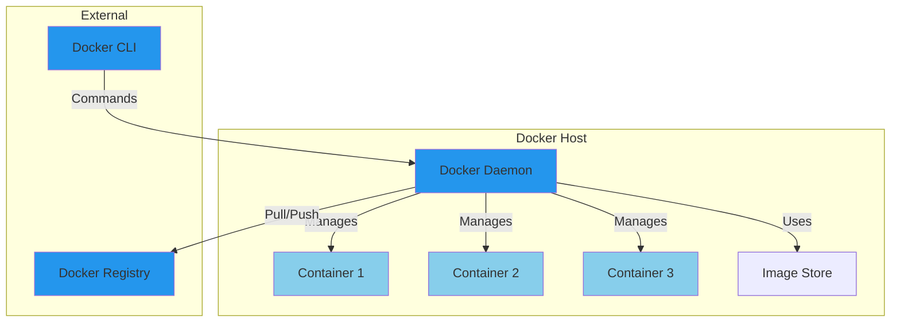
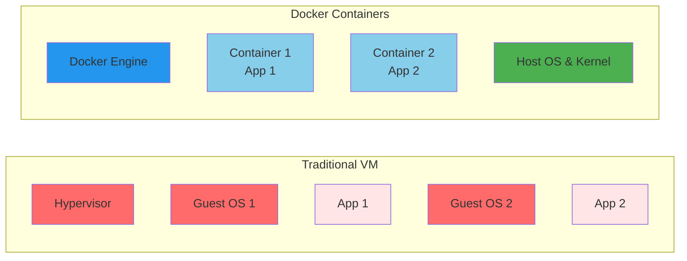

# Docker Basics

Fundamental Docker concepts, architecture, and core principles.

---

## What is Docker?

Docker is a containerization platform that allows you to package applications with all their dependencies into a standardized unit called a **container**. This ensures consistency across development, testing, and production environments.

### Docker Architecture



**Components:**
- **Docker Daemon**: Background service that manages containers
- **Docker CLI**: Command-line interface for user interaction
- **Images**: Blueprints/templates for containers
- **Containers**: Running instances of images
- **Registry**: Storage for images (Docker Hub, private registries)

---

## Key Concepts

### Containers vs Virtual Machines



**Differences:**
- **VMs**: Full OS + Kernel (heavier, slower to start)
- **Containers**: Share host kernel (lightweight, faster)
- **Resource Usage**: Containers use significantly less memory and disk
- **Boot Time**: Containers start in milliseconds, VMs in seconds/minutes

### Images

**Question: What is a Docker image?**

A Docker image is a **lightweight, immutable template** that contains:
- Application code
- Runtime environment
- System libraries
- Environment variables
- Metadata

**Example:**
```bash
# Images are like blueprints
docker images

# Output shows:
# REPOSITORY    TAG       IMAGE ID      CREATED      SIZE
# nginx         latest    a92c...       2 weeks ago  191MB
# ubuntu        20.04     b47...       1 month ago  77.8MB
```

**Tags:** `#docker` `#image` `#concepts`

---

### Containers

**Question: What is a Docker container?**

A Docker container is a **running instance of an image**. Think of it as:
- Image = Class in programming
- Container = Object/instance

**Example:**
```bash
# Containers are instances
docker ps

# Output shows:
# CONTAINER ID  IMAGE   COMMAND  CREATED  STATUS  PORTS  NAMES
# 3e5c...       nginx   "..."    1 min    Up 1m   80/tcp web_server
```

**Characteristics:**
- Isolated filesystem
- Isolated network
- Isolated processes
- Temporary (changes lost on delete unless committed)

**Tags:** `#docker` `#container` `#concepts`

---

## Docker Workflow

### Development to Production

```mermaid
graph LR
    A["1. Write Code"] -->|Dockerfile| B["2. Build Image"]
    B -->|docker build| C["3. Local Testing"]
    C -->|docker run| D["4. Push to Registry"]
    D -->|docker push| E["5. Deploy to Production"]
    E -->|docker pull| F["6. Run Container"]
    
    style A fill:#E8F5E9
    style B fill:#FFE5B4
    style C fill:#E3F2FD
    style D fill:#FCE4EC
    style E fill:#F3E5F5
    style F fill:#E8F5E9
```



**Steps:**

1. **Write Code** - Create application
2. **Create Dockerfile** - Define image blueprint
3. **Build Image** - `docker build -t myapp:1.0 .`
4. **Test Locally** - `docker run myapp:1.0`
5. **Push to Registry** - `docker push myapp:1.0`
6. **Deploy** - Pull and run on production servers

**Tags:** `#docker` `#workflow` `#deployment`

---

## Docker File Hierarchy

```
Dockerfile (defines image)
    ↓
Image (built from Dockerfile)
    ↓
Container (running instance)
    ↓
Data (persistent via volumes)
```

---

## Installing Docker

### On Linux (Ubuntu/Debian)

**Question: How do I install Docker on Ubuntu?**

**Command:**
```bash
# Update package manager
sudo apt-get update

# Install required packages
sudo apt-get install -y \
    ca-certificates \
    curl \
    gnupg \
    lsb-release

# Add Docker GPG key
curl -fsSL https://download.docker.com/linux/ubuntu/gpg | sudo gpg --dearmor -o /usr/share/keyrings/docker-archive-keyring.gpg

# Add Docker repository
echo \
  "deb [arch=amd64 signed-by=/usr/share/keyrings/docker-archive-keyring.gpg] https://download.docker.com/linux/ubuntu \
  $(lsb_release -cs) stable" | sudo tee /etc/apt/sources.list.d/docker.list > /dev/null

# Install Docker
sudo apt-get update
sudo apt-get install -y docker-ce docker-ce-cli containerd.io docker-compose-plugin

# Start Docker
sudo systemctl start docker
sudo systemctl enable docker

# Verify installation
docker --version
```

**Tags:** `#docker` `#installation` `#ubuntu`

---

### On RHEL/CentOS

**Command:**
```bash
# Install Docker
sudo yum install -y docker

# Start Docker
sudo systemctl start docker
sudo systemctl enable docker

# Verify
docker --version
```

**Tags:** `#docker` `#installation` `#rhel`

---

## Docker Commands Quick Reference

```bash
# Image operations
docker images              # List images
docker pull ubuntu         # Download image
docker build -t app:1.0 .  # Build image
docker rmi image_name      # Remove image

# Container operations
docker ps                  # List running containers
docker ps -a              # List all containers
docker run ubuntu          # Run container
docker stop container_id   # Stop container
docker rm container_id     # Remove container

# Container inspection
docker logs container_id   # View logs
docker exec -it id bash   # Open shell in container
docker inspect container_id # Get details
```

**Tags:** `#docker` `#commands` `#reference`

---

## Related Resources
- [Containers](../containers/index.md)
- [Images](../images/index.md)
- [Networking](../networking/index.md)
- [Storage](../storage/index.md)

---

**Tags:** `#docker` `#basics` `#concepts` `#architecture`
