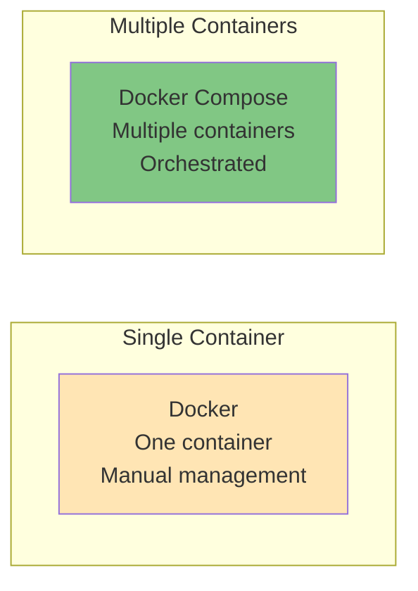
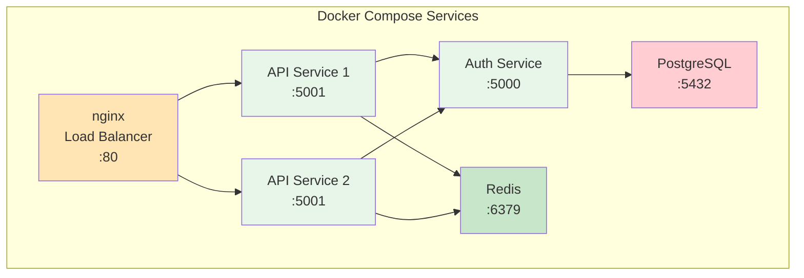
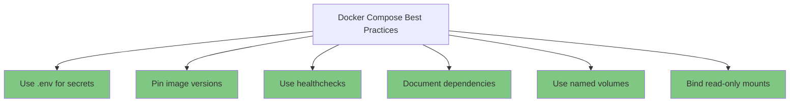

# Docker Compose

Multi-container application orchestration with Docker Compose.

---

## What is Docker Compose?

Docker Compose is a tool for defining and running multi-container Docker applications using a YAML configuration file.

### Docker Compose vs Docker



**Use Docker Compose when:**
- Application needs multiple services
- Services need to communicate
- Configuration should be version-controlled
- Development and production environments similar

**Tags:** `#docker-compose` `#orchestration` `#multi-container`

---

## Docker Compose File

### Basic Structure

**Question: How do I define a multi-container application?**

**Create `docker-compose.yml`:**
```yaml
version: '3.9'

services:
  web:
    image: nginx:latest
    ports:
      - "8080:80"
    volumes:
      - ./html:/usr/share/nginx/html:ro
    depends_on:
      - app

  app:
    image: myapp:1.0
    ports:
      - "5000:5000"
    environment:
      - DATABASE_URL=postgres://db:5432/mydb
      - REDIS_URL=redis://cache:6379
    depends_on:
      - db
      - cache

  db:
    image: postgres:13
    environment:
      POSTGRES_DB: mydb
      POSTGRES_PASSWORD: secret
    volumes:
      - postgres-data:/var/lib/postgresql/data
    ports:
      - "5432:5432"

  cache:
    image: redis:latest
    ports:
      - "6379:6379"

volumes:
  postgres-data:

networks:
  default:
    name: myapp-network
```

**File Structure:**
- `version` - Compose file format version
- `services` - Container definitions
- `volumes` - Persistent storage
- `networks` - Container networking

**Tags:** `#docker-compose` `#yml` `#configuration`

---

### Service Definition

**Command Breakdown:**
```yaml
services:
  myservice:
    image: ubuntu:20.04           # Image to use
    build:                        # Or build from Dockerfile
      context: .                  # Build context
      dockerfile: Dockerfile
    container_name: my_container  # Custom name
    ports:
      - "8080:80"                 # Port mapping
      - "443:443"
    environment:                  # Environment variables
      - DEBUG=true
      - API_KEY=secret
    volumes:
      - mydata:/data              # Named volume
      - ./config:/etc/app:ro      # Bind mount (read-only)
    depends_on:                   # Startup order
      - db
      - cache
    networks:
      - mynetwork
    restart: always               # Restart policy
    command: python3 app.py       # Override CMD
    working_dir: /app             # Working directory
    user: "1000:1000"             # Run as user
```

**Tags:** `#docker-compose` `#service` `#configuration`

---

## Running Docker Compose

### Start Services

**Command:**
```bash
# Start all services
docker-compose up

# Start in background
docker-compose up -d

# Build images if needed
docker-compose up --build

# Scale service
docker-compose up -d --scale worker=3
# Creates web_1, web_2, web_3
```

**Expected Output:**
```
Creating network "myapp_default" with the default driver
Creating myapp_db_1    ... done
Creating myapp_cache_1 ... done
Creating myapp_app_1   ... done
Creating myapp_web_1   ... done
```

**Tags:** `#docker-compose` `#up` `#start`

---

### Stop and Remove

**Command:**
```bash
# Stop services (preserve containers)
docker-compose stop

# Stop specific service
docker-compose stop web

# Remove containers
docker-compose down

# Remove containers and volumes
docker-compose down -v

# Remove containers, volumes, and images
docker-compose down --rmi all
```

**Tags:** `#docker-compose` `#down` `#stop` `#cleanup`

---

## Managing Services

### View Logs

**Command:**
```bash
# View all logs
docker-compose logs

# Follow logs
docker-compose logs -f

# Specific service
docker-compose logs -f app

# Last 50 lines
docker-compose logs --tail 50

# With timestamps
docker-compose logs -t
```

**Tags:** `#docker-compose` `#logs` `#debugging`

---

### Execute Commands

**Command:**
```bash
# Execute command in service
docker-compose exec app python3 manage.py migrate

# Interactive shell
docker-compose exec app bash

# As specific user
docker-compose exec -u postgres db psql -U postgres
```

**Tags:** `#docker-compose` `#exec` `#shell`

---

### View Service Status

**Command:**
```bash
# List services
docker-compose ps

# Format output
docker-compose ps --format json

# Detailed services
docker-compose config
```

**Expected Output:**
```
NAME               COMMAND                SERVICE   STATUS      PORTS
myapp-app-1        "python3 app.py"       app       Up 1 min    5000/tcp
myapp-cache-1      "redis-server"         cache     Up 1 min    6379/tcp
myapp-db-1         "postgres"             db        Up 1 min    5432/tcp
myapp-web-1        "nginx -g daemon..."   web       Up 1 min    0.0.0.0:8080->80/tcp
```

**Tags:** `#docker-compose` `#ps` `#status`

---

## Real-World Examples

### Web Application Stack

```yaml
version: '3.9'

services:
  # Frontend
  nginx:
    image: nginx:latest
    ports:
      - "80:80"
      - "443:443"
    volumes:
      - ./nginx.conf:/etc/nginx/nginx.conf:ro
      - ./html:/usr/share/nginx/html:ro
    depends_on:
      - app

  # Application
  app:
    build: .
    expose:
      - "5000"
    environment:
      - FLASK_ENV=production
      - DATABASE_URL=postgres://app:password@db:5432/mydb
      - REDIS_URL=redis://cache:6379
    volumes:
      - ./app:/app
    depends_on:
      - db
      - cache

  # Database
  db:
    image: postgres:13-alpine
    environment:
      POSTGRES_DB: mydb
      POSTGRES_USER: app
      POSTGRES_PASSWORD: password
    volumes:
      - postgres-data:/var/lib/postgresql/data
    healthcheck:
      test: ["CMD-SHELL", "pg_isready -U app"]
      interval: 10s
      timeout: 5s
      retries: 5

  # Cache
  cache:
    image: redis:7-alpine
    expose:
      - "6379"
    healthcheck:
      test: ["CMD", "redis-cli", "ping"]
      interval: 10s
      timeout: 5s
      retries: 5

volumes:
  postgres-data:
```

**Start:**
```bash
docker-compose up -d

# Check status
docker-compose ps

# View logs
docker-compose logs -f app
```

**Tags:** `#docker-compose` `#web-app` `#example`

---

### Microservices Architecture



**Tags:** `#docker-compose` `#microservices` `#architecture`

---

## Networking in Compose

### Service-to-Service Communication

**Question: How do services communicate in Compose?**

```bash
# All services automatically on same network
# Services can reach each other by name

# Example: Web service connects to database
# Connection string: postgres://db:5432/mydb
#                               ^^
#                         Service name (DNS resolution)
```

**In app code:**
```python
# Python example
import psycopg2
conn = psycopg2.connect(
    host="db",          # Service name
    database="mydb",
    user="postgres",
    password="secret"
)
```

**Tags:** `#docker-compose` `#networking` `#dns`

---

## Compose Best Practices



**Best Practices:**

1. **Use .env for Secrets**
```bash
# .env file
POSTGRES_PASSWORD=secret
API_KEY=12345

# docker-compose.yml
environment:
  - POSTGRES_PASSWORD=${POSTGRES_PASSWORD}
  - API_KEY=${API_KEY}
```

2. **Pin Image Versions**
```yaml
# ✅ Good
image: postgres:13-alpine

# ❌ Avoid
image: postgres:latest  # Unpredictable
```

3. **Add Healthchecks**
```yaml
healthcheck:
  test: ["CMD", "curl", "-f", "http://localhost/health"]
  interval: 30s
  timeout: 10s
  retries: 3
```

**Tags:** `#docker-compose` `#best-practices`

---

## Troubleshooting

### Common Issues

**Service won't start:**
```bash
# View logs
docker-compose logs service_name

# Check configuration
docker-compose config

# Rebuild and restart
docker-compose down
docker-compose up --build
```

**Services can't communicate:**
```bash
# Verify network
docker network ls
docker network inspect <network_name>

# Check DNS resolution
docker-compose exec service1 ping service2
```

**Port conflicts:**
```bash
# Change port in docker-compose.yml
ports:
  - "8081:80"  # Use different host port
```

**Tags:** `#docker-compose` `#troubleshooting`

---

## Related Resources
- [Basics](../basics/index.md)
- [Images](../images/index.md)
- [Containers](../containers/index.md)
- [Networking](../networking/index.md)
- [Storage](../storage/index.md)

---

**Tags:** `#docker-compose` `#orchestration` `#multi-container` `#yml`
