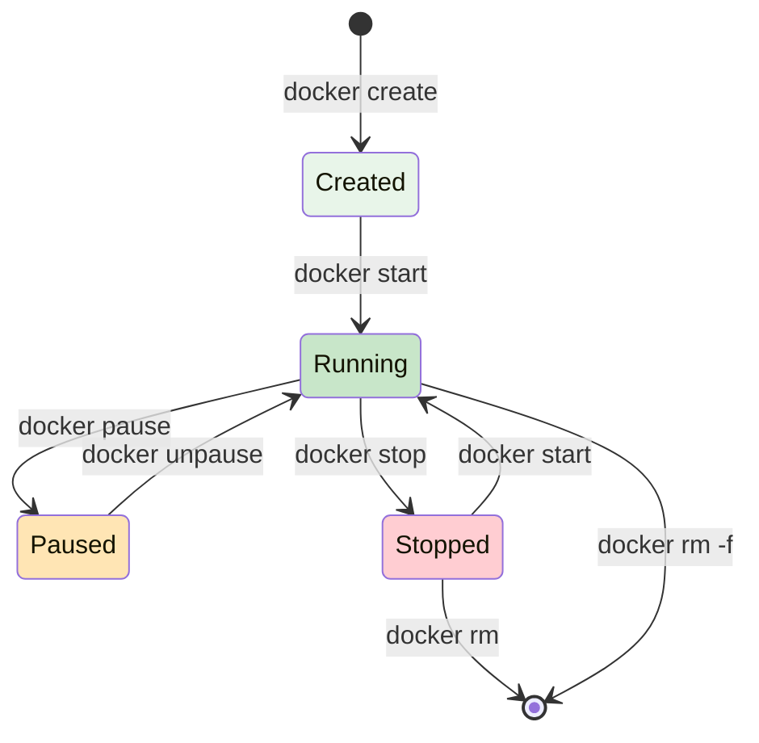
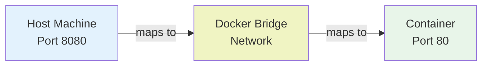
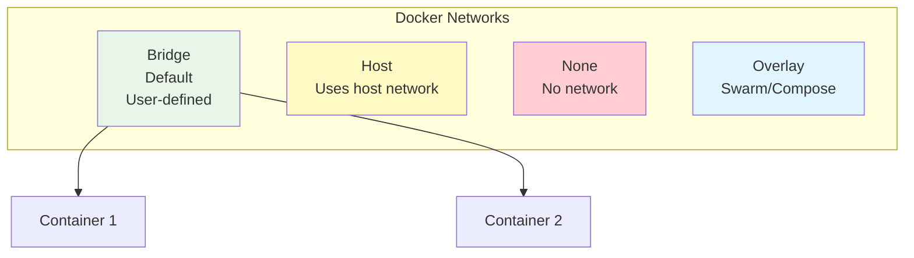

# Docker Containers

Creating, managing, and working with Docker containers.

---

## Container Lifecycle

**Question: What is the lifecycle of a Docker container?**



**States:**
- **Created**: Image loaded, container not started
- **Running**: Container executing with PID 1
- **Paused**: Container frozen (processes stopped)
- **Stopped**: Container stopped but not removed
- **Exited**: Container completed/failed

**Tags:** `#docker` `#container` `#lifecycle`

---

## Running Containers

### Basic Container Run

**Question: How do I start a container?**

**Command:**
```bash
# Run container (detached)
docker run -d --name webserver -p 8080:80 nginx

# Run container (interactive)
docker run -it ubuntu /bin/bash

# Run container with output
docker run -it --name test alpine echo "Hello Docker"
```

**Options:**
- `-d` - Detached mode (background)
- `-it` - Interactive terminal
- `--name` - Container name
- `-p` - Port mapping (host:container)
- `--rm` - Auto-remove on exit

**Expected Output:**
```
3e5c7a9f8b2d
```
(Container ID)

**Tags:** `#docker` `#run` `#container`

---

### Port Mapping

**Question: How do I access container services from the host?**



**Command:**
```bash
# Map single port
docker run -p 8080:80 nginx
# Acccess via: http://localhost:8080

# Map multiple ports
docker run -p 8080:80 -p 443:443 nginx

# Map all exposed ports
docker run -P nginx

# Bind to specific interface
docker run -p 127.0.0.1:8080:80 nginx

# Dynamic port mapping
docker run -p 8080 nginx
# System assigns random port > 1024
```

**Tags:** `#docker` `#port-mapping` `#networking`

---

### Environment Variables

**Command:**
```bash
# Set environment variables
docker run -e DATABASE_URL=postgres://localhost \
           -e DEBUG=true \
           myapp:1.0

# From .env file
docker run --env-file .env myapp:1.0

# Verify environment
docker run -e MY_VAR=hello alpine env | grep MY_VAR
# Output: MY_VAR=hello
```

**Tags:** `#docker` `#environment` `#variables`

---

## Managing Containers

### List Containers

**Command:**
```bash
# List running containers
docker ps

# List all containers
docker ps -a

# Show container sizes
docker ps -s

# Custom format
docker ps --format "table {{.ID}}\t{{.Names}}\t{{.Status}}"
```

**Expected Output:**
```
CONTAINER ID    IMAGE     COMMAND              CREATED        STATUS
3e5c7a9f8b2d    nginx     "nginx -g daemon..." 2 minutes ago  Up 2 minutes
4f2d8c1a9e7b    ubuntu    "/bin/bash"          1 hour ago     Exited (0)
```

**Tags:** `#docker` `#ps` `#list`

---

### Inspect Container

**Command:**
```bash
# Get detailed information
docker inspect container_id

# Get specific fields
docker inspect -f '{{.State.Running}}' container_id

# Get IP address
docker inspect -f '{{.NetworkSettings.IPAddress}}' container_id

# Get port mappings
docker inspect -f '{{.NetworkSettings.Ports}}' container_id
```

**Tags:** `#docker` `#inspect` `#container`

---

### Container Logs

**Command:**
```bash
# View logs
docker logs container_id

# Follow logs (tail -f style)
docker logs -f container_id

# Last 50 lines
docker logs --tail 50 container_id

# Show timestamps
docker logs -t container_id

# Since specific time
docker logs --since 2024-01-15T10:00:00 container_id
```

**Tags:** `#docker` `#logs` `#debugging`

---

### Execute Commands in Container

**Command:**
```bash
# Open interactive shell
docker exec -it container_id /bin/bash

# Run single command
docker exec container_id ls -la

# Run as specific user
docker exec -u www-data container_id whoami

# Get environment
docker exec container_id env | grep PATH
```

**Tags:** `#docker` `#exec` `#shell`

---

## Container Control

### Stop and Start

**Command:**
```bash
# Stop container gracefully
docker stop container_id

# Forcefully kill container
docker kill container_id

# Start stopped container
docker start container_id

# Restart container
docker restart container_id

# Stop all running containers
docker stop $(docker ps -q)
```

**Expected Output:**
```
container_id
```

**Tags:** `#docker` `#stop` `#start` `#restart`

---

### Pause and Unpause

**Command:**
```bash
# Pause container (freeze processes)
docker pause container_id

# Unpause container
docker unpause container_id
```

**Use Case:** Temporarily freeze resource-heavy container

**Tags:** `#docker` `#pause` `#unpause`

---

### Remove Containers

**Command:**
```bash
# Remove stopped container
docker rm container_id

# Remove running container (force)
docker rm -f container_id

# Remove multiple containers
docker rm container1 container2 container3

# Remove all stopped containers
docker container prune

# Remove containers with specific status
docker rm $(docker ps -a -q -f status=exited)
```

**Tags:** `#docker` `#rm` `#remove` `#cleanup`

---

## Container Metadata

### Attach to Container

**Command:**
```bash
# Attach to running container
docker attach container_id

# View without attaching
docker logs -f container_id
```

**Tags:** `#docker` `#attach`

---

### Get Container Stats

**Question: How do I monitor container resource usage?**

**Command:**
```bash
# View live stats
docker stats

# Specific container
docker stats container_id

# No-stream (one-time output)
docker stats --no-stream
```

**Expected Output:**
```
CONTAINER ID  NAME        CPU %   MEM USAGE / LIMIT
3e5c7a9f8b2d  webserver   0.15%   45.2 MiB / 3.5 GiB
4f2d8c1a9e7b  database    2.34%   512 MiB / 3.5 GiB
```

**Tags:** `#docker` `#stats` `#monitoring`

---

### Copy Files to/from Container

**Command:**
```bash
# Copy from host to container
docker cp /path/to/file container_id:/app/

# Copy from container to host
docker cp container_id:/app/file.txt /path/to/

# Copy directory
docker cp container_id:/app /local/path/
```

**Tags:** `#docker` `#cp` `#copy` `#files`

---

## Container Networking

### Network Types



**Types:**
- **Bridge**: Default, containers on same network can communicate
- **Host**: Container shares host's network stack
- **None**: No network access
- **Overlay**: For Swarm/Kubernetes

**Tags:** `#docker` `#networking` `#networks`

---

## Related Resources
- [Basics](../basics/index.md)
- [Networking](../networking/index.md)
- [Storage](../storage/index.md)

---

**Tags:** `#docker` `#container` `#lifecycle` `#management`
