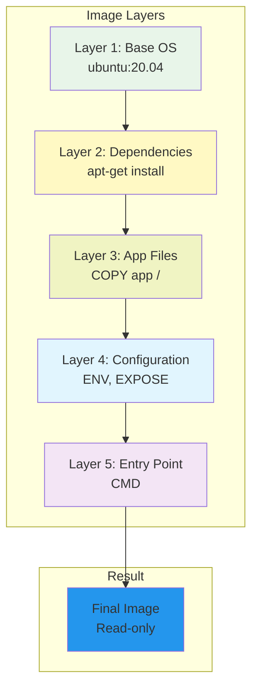

# Docker Images

Building, managing, and working with Docker images.

---

## Understanding Docker Images

### Image Layers

**Question: How are Docker images structured?**

Docker images are built in **layers**. Each instruction in a Dockerfile creates a new layer.



**Characteristics:**
- Each layer is immutable (read-only)
- Layers are cached for faster rebuilds
- Only the top layer (container) is writable
- Smaller images = fewer, smaller layers

**Tags:** `#docker` `#image` `#layers`

---

## Building Images with Dockerfile

### Dockerfile Syntax

**Question: How do I create a Docker image?**

**Create a Dockerfile:**
```dockerfile
# Use base image
FROM ubuntu:20.04

# Set metadata
LABEL version="1.0" description="My Application"

# Set working directory
WORKDIR /app

# Install dependencies
RUN apt-get update && apt-get install -y \
    python3 \
    python3-pip

# Copy application files
COPY requirements.txt .
COPY app.py .

# Install Python packages
RUN pip3 install -r requirements.txt

# Expose port
EXPOSE 5000

# Set environment variables
ENV APP_ENV=production

# Run application
CMD ["python3", "app.py"]
```

**Dockerfile Instructions:**
- `FROM` - Base image to build upon
- `LABEL` - Metadata key-value pairs
- `WORKDIR` - Set working directory
- `RUN` - Execute commands during build
- `COPY` - Copy files from host to image
- `ADD` - Like COPY but can handle URLs/archives
- `EXPOSE` - Document exposed ports (doesn't actually expose)
- `ENV` - Set environment variables
- `CMD` - Default command when container starts
- `ENTRYPOINT` - Configure as executable

**Tags:** `#docker` `#dockerfile` `#image-build`

---

### Build an Image

**Command:**
```bash
# Build image
docker build -t myapp:1.0 .

# Build with multiple tags
docker build -t myapp:1.0 -t myapp:latest .

# Build with build arguments
docker build -t myapp:1.0 \
    --build-arg NODE_ENV=production \
    .

# View build progress
docker build -t myapp:1.0 --progress=plain .
```

**Expected Output:**
```
[+] Building 45.2s (10/10) FINISHED
 => [internal] load build definition from Dockerfile
 => [1/5] FROM ubuntu:20.04
 => [2/5] RUN apt-get update && apt-get install -y python3
 => [3/5] COPY app.py /app/
 => [4/5] WORKDIR /app
 => [5/5] CMD ["python3", "app.py"]
```

**Tags:** `#docker` `#build` `#image`

---

## Managing Images

### List Images

**Command:**
```bash
# List local images
docker images

# Show all images including intermediate layers
docker images -a

# Filter images
docker images --filter "reference=ubuntu*"

# Show image size
docker images --format "table {{.Repository}}\t{{.Size}}"
```

**Expected Output:**
```
REPOSITORY          TAG       IMAGE ID      CREATED      SIZE
ubuntu              20.04     b47221a56e72  2 weeks ago  77.8MB
nginx               latest    a92c...       2 weeks ago  191MB
python              3.9       77...         2 weeks ago  916MB
```

**Tags:** `#docker` `#image` `#list`

---

### Inspect Image

**Question: How do I get detailed information about an image?**

**Command:**
```bash
# Inspect image details
docker inspect ubuntu:20.04

# Get specific field
docker inspect -f '{{.Config.Cmd}}' ubuntu:20.04

# Get exposed ports
docker inspect -f '{{.Config.ExposedPorts}}' nginx
```

**Expected Output (partial):**
```json
[
  {
    "Id": "sha256:b47...",
    "RepoTags": ["ubuntu:20.04"],
    "Size": 77800000,
    "Architecture": "amd64",
    "Os": "linux",
    "Config": {
      "Cmd": ["/bin/bash"],
      "WorkingDir": "",
      "Volumes": null
    }
  }
]
```

**Tags:** `#docker` `#inspect` `#image`

---

### Tag Image

**Question: How do I tag and version images?**

**Command:**
```bash
# Tag existing image
docker tag myapp:1.0 myapp:latest

# Tag for registry push
docker tag myapp:1.0 docker.io/username/myapp:1.0

# Tag local image
docker tag ubuntu:20.04 myubuntu:custom
```

**Example:**
```bash
# Build and tag in one step
docker build -t myapp:1.0 -t myapp:latest .

# Now have two tags pointing to same image
docker images | grep myapp
# myapp       1.0        a92c...    2 min ago   191MB
# myapp       latest     a92c...    2 min ago   191MB
```

**Tags:** `#docker` `#tag` `#versioning`

---

### Push and Pull Images

**Question: How do I share images via Docker Hub or registry?**

**Push to Docker Hub:**
```bash
# Login to Docker Hub
docker login

# Tag image for Hub
docker tag myapp:1.0 username/myapp:1.0

# Push image
docker push username/myapp:1.0

# Expected output:
# Pushing myapp:1.0
# Pushed successfully
```

**Pull from Registry:**
```bash
# Pull from Docker Hub (default)
docker pull ubuntu:20.04

# Pull from private registry
docker pull registry.company.com/myapp:1.0

# Pull all tags
docker pull -a ubuntu
```

**Tags:** `#docker` `#push` `#pull` `#registry`

---

### Remove Images

**Command:**
```bash
# Remove single image
docker rmi ubuntu:20.04

# Remove multiple images
docker rmi image1:tag1 image2:tag2

# Remove unused images
docker image prune

# Remove all images (be careful!)
docker rmi $(docker images -q)

# Remove images matching pattern
docker rmi $(docker images | grep "none" | awk '{print $3}')
```

**Tags:** `#docker` `#remove` `#rmi` `#cleanup`

---

## Image Best Practices

### Multi-stage Builds

**Question: How do I reduce image size using multi-stage builds?**

```dockerfile
# Stage 1: Build
FROM golang:1.19 AS builder
WORKDIR /app
COPY . .
RUN go build -o myapp .

# Stage 2: Runtime (much smaller)
FROM alpine:latest
WORKDIR /app
COPY --from=builder /app/myapp .
CMD ["./myapp"]
```

**Benefit:** Final image only contains runtime, not build tools.

**Tags:** `#docker` `#multi-stage` `#optimization`

---

### Minimize Image Size

**Best Practices:**
```dockerfile
# ✅ GOOD: Minimize layers and size
FROM alpine:latest
RUN apk add --no-cache python3 && \
    apk add --no-cache py3-pip

# ❌ AVOID: Separate commands create extra layers
FROM ubuntu:20.04
RUN apt-get update
RUN apt-get install -y python3
RUN apt-get install -y python3-pip

# ✅ Use .dockerignore to exclude unnecessary files
# Add .git, node_modules, tests, etc.
```

**Tags:** `#docker` `#optimization` `#best-practices`

---

## Related Resources
- [Basics](../basics/index.md)
- [Containers](../containers/index.md)
- [Docker Compose](../compose/index.md)

---

**Tags:** `#docker` `#image` `#dockerfile` `#build`
