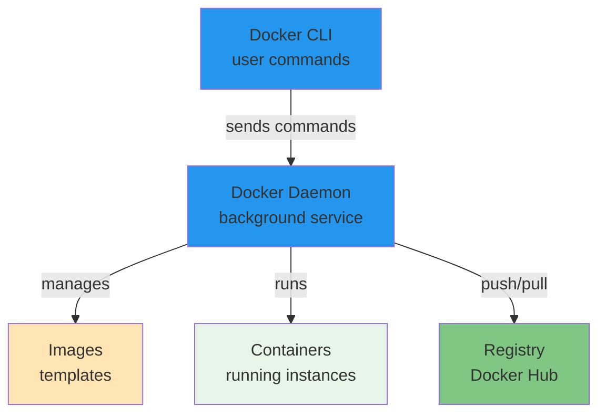

# Docker

Comprehensive Docker containerization, image management, networking, storage, and orchestration guides.

## Quick Navigation

<div class="grid cards" markdown>

-   :material-school:{ .lg .middle } __Basics__

    ---

    Docker concepts, architecture, and installation

    [:octicons-arrow-right-24: Learn Basics](basics/index.md)

-   :material-image:{ .lg .middle } __Images__

    ---

    Building, managing, and optimizing Docker images

    [:octicons-arrow-right-24: Explore Images](images/index.md)

-   :material-package-variant:{ .lg .middle } __Containers__

    ---

    Container lifecycle, management, and operations

    [:octicons-arrow-right-24: Manage Containers](containers/index.md)

-   :material-connection:{ .lg .middle } __Networking__

    ---

    Container communication and network configuration

    [:octicons-arrow-right-24: Configure Networks](networking/index.md)

-   :material-database:{ .lg .middle } __Storage & Volumes__

    ---

    Data persistence, volumes, and storage management

    [:octicons-arrow-right-24: Manage Storage](storage/index.md)

-   :material-orchestration:{ .lg .middle } __Docker Compose__

    ---

    Multi-container orchestration and application definition

    [:octicons-arrow-right-24: Use Compose](compose/index.md)

</div>

---

## Quick Reference

### Common Commands
```bash
# Images
docker images              # List images
docker build -t app:1.0 .  # Build image
docker push app:1.0        # Push to registry

# Containers
docker run -d -p 8080:80 app:1.0    # Run container
docker ps                             # List running
docker logs -f container_id           # View logs
docker exec -it container_id bash     # Execute command

# Networking
docker network create mynet           # Create network
docker network inspect mynet          # Inspect network

# Volumes
docker volume create mydata           # Create volume
docker volume ls                      # List volumes

# Compose
docker-compose up -d                  # Start services
docker-compose logs -f                # View logs
```

---

## Docker Architecture Overview



---

## Learning Path

1. **Start with [Basics](basics/index.md)**
   - Understand Docker concepts and architecture
   - Learn installation and setup

2. **Learn [Images](images/index.md)**
   - Create and build Docker images
   - Understand Dockerfile syntax

3. **Master [Containers](containers/index.md)**
   - Run and manage containers
   - Container lifecycle and operations

4. **Configure [Networking](networking/index.md)**
   - Container communication
   - Network setup and DNS

5. **Manage [Storage](storage/index.md)**
   - Data persistence with volumes
   - Working with bind mounts

6. **Use [Docker Compose](compose/index.md)**
   - Multi-container applications
   - Application orchestration

---

## Related Resources
- [Linux](../../linux/index.md) - Base OS knowledge
- [Kubernetes](../kubernetes/index.md) - Container orchestration
- [Databases](../../databases/index.md) - Database in containers

---

**Tags:** `#docker` `#containers` `#deployment` `#orchestration`
