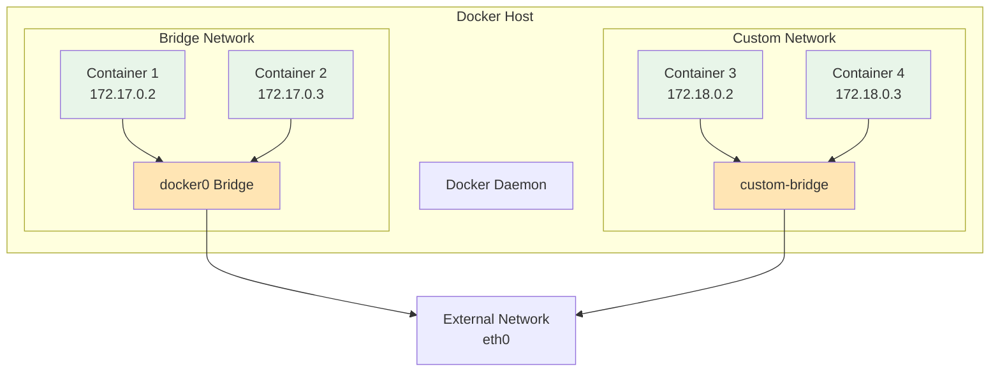
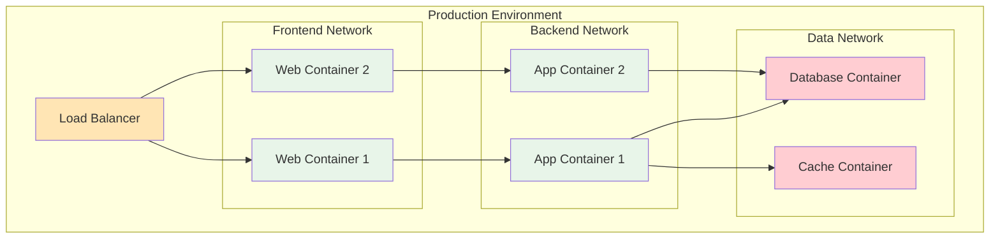

# Docker Networking

Docker network configuration, container communication, and network management.

---

## Docker Network Architecture



---

## Network Types

### Bridge Network (Default)

**Question: What is the default bridge network?**

When you run a container without specifying a network, it connects to the default bridge network (`docker0`).

**Command:**
```bash
# Inspect default bridge
docker network inspect bridge

# Create custom bridge network
docker network create mynetwork

# Connect container to bridge
docker run --network mynetwork --name web nginx
```

**Expected Output (inspect):**
```json
{
  "Name": "bridge",
  "Driver": "bridge",
  "IPAM": {
    "Config": [{"Subnet": "172.17.0.0/16"}]
  },
  "Containers": {
    "3e5c...": {"Name": "web", "IPv4Address": "172.17.0.2/16"}
  }
}
```

**Tags:** `#docker` `#bridge` `#network`

---

### Host Network

**Question: When should I use host network?**

The container shares the host's network stack (no isolation).

**Command:**
```bash
# Run container on host network
docker run --network host myapp

# Check network interfaces
docker run --network host ip addr
```

**Use Cases:**
- High performance requirement
- Direct access to host networking
- Monitoring/debugging tools

**Disadvantage:** No network isolation

**Tags:** `#docker` `#host-network` `#performance`

---

### None Network

**Command:**
```bash
# Container with no network
docker run --network none myapp

# Verify
docker exec container_id ip addr
# Output: only loopback interface
```

**Use Cases:**
- Completely isolated containers
- Batch/offline processing jobs

**Tags:** `#docker` `#none-network` `#isolation`

---

## Container Communication

### Inter-container Communication (Same Network)

**Question: How do containers on the same network communicate?**

```bash
# Create custom network
docker network create mynet

# Run two containers on same network
docker run -d --name web --network mynet nginx
docker run -d --name db --network mynet postgres

# From web container, ping db by name
docker exec web ping db
# PING db (172.18.0.3): 56 data bytes
# 64 bytes from 172.18.0.3: seq=0 ttl=64 time=0.1 ms
```

**Key Feature:** Containers on custom networks can resolve container names to IP addresses (DNS resolution).

**Tags:** `#docker` `#communication` `#networking`

---

### Port Publishing

**Question: How do I expose container ports to the host?**

**Command:**
```bash
# Publish single port
docker run -p 8080:80 nginx
# Access via: http://localhost:8080

# Publish multiple ports
docker run -p 8080:80 -p 8443:443 nginx

# Bind to specific interface
docker run -p 127.0.0.1:8080:80 nginx
# Only accessible from localhost

# UDP port
docker run -p 5353:53/udp alpine

# Range of ports
docker run -p 7000-8000:7000-8000 nginx
```

**Port Mapping Diagram:**
```
Host Port 8080 ---> Docker Network ---> Container Port 80
```

**Tags:** `#docker` `#port-mapping` `#publish`

---

## Network Management

### Create Network

**Command:**
```bash
# Create bridge network
docker network create mynetwork

# Create with specific subnet
docker network create --subnet 172.20.0.0/16 mynetwork

# Create overlay network (for Swarm)
docker network create -d overlay my-overlay

# Inspect network
docker network inspect mynetwork
```

**Expected Output:**
```json
{
  "Name": "mynetwork",
  "Driver": "bridge",
  "IPAM": {
    "Config": [{"Subnet": "172.20.0.0/16"}]
  },
  "Containers": {}
}
```

**Tags:** `#docker` `#network-create`

---

### Connect/Disconnect Container

**Command:**
```bash
# Connect running container to network
docker network connect mynetwork container_id

# Disconnect from network
docker network disconnect mynetwork container_id

# View network details
docker network inspect mynetwork
```

**Use Case:** Move container between networks without restarting

**Tags:** `#docker` `#network-connect` `#network-disconnect`

---

### List Networks

**Command:**
```bash
# List all networks
docker network ls

# Filter by driver
docker network ls --filter driver=bridge

# Format output
docker network ls --format "table {{.Name}}\t{{.Driver}}"
```

**Expected Output:**
```
NETWORK ID    NAME              DRIVER
b47a...       bridge            bridge
8c1f...       host              host
2d8e...       none              null
a3f2...       mynetwork         bridge
```

**Tags:** `#docker` `#network-ls`

---

### Remove Network

**Command:**
```bash
# Remove network (must be unconnected)
docker network rm mynetwork

# Remove all unused networks
docker network prune
```

**Tags:** `#docker` `#network-rm` `#cleanup`

---

## DNS and Service Discovery

### Container DNS Resolution

**Question: How do containers discover each other?**

**With Custom Network:**
```bash
# Containers can resolve each other by name
docker network create mynet
docker run -d --name db --network mynet postgres
docker run -d --name app --network mynet myapp

# Inside app container:
docker exec app curl http://db:5432
# Container name automatically resolves to IP
```

**Default Bridge (Limited):**
- Containers must link with `--link` flag (deprecated)
- Prefer custom networks for modern setup

**Tags:** `#docker` `#dns` `#service-discovery`

---

## Network Best Practices

### Production Network Setup



**Best Practices:**
- Create separate networks for different tiers
- Use custom bridge networks (not default bridge)
- Never expose all services to internet
- Use firewall rules to restrict traffic
- Document network topology

**Tags:** `#docker` `#networking` `#best-practices`

---

## Related Resources
- [Containers](../containers/index.md)
- [Docker Compose](../compose/index.md)
- [Storage](../storage/index.md)

---

**Tags:** `#docker` `#networking` `#bridge` `#dns` `#communication`
