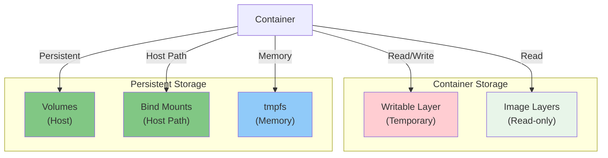
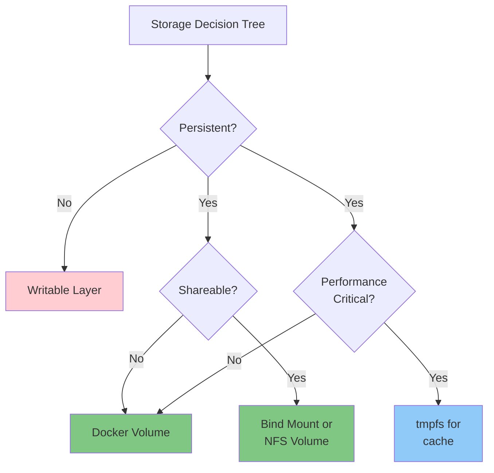

# Docker Storage and Volumes

Data persistence, volume management, and storage drivers in Docker.

---

## Storage Architecture



---

## Container Writable Layer

**Question: Where does container data go?**

Containers have a writable layer on top of image layers. Changes are lost when container is deleted.

```bash
# Data is temporary - lost on deletion
docker run ubuntu touch /tmp/myfile.txt
docker ps -a  # Container has exited
docker rm container_id
# File is gone!
```

**This is why we use volumes for persistent data.**

**Tags:** `#docker` `#storage` `#layers`

---

## Docker Volumes

### Creating Volumes

**Question: How do I create persistent storage?**

**Command:**
```bash
# Create volume
docker volume create mydata

# List volumes
docker volume ls

# Inspect volume
docker volume inspect mydata
```

**Expected Output:**
```json
[
  {
    "Name": "mydata",
    "Driver": "local",
    "Mountpoint": "/var/lib/docker/volumes/mydata/_data",
    "Labels": {},
    "Scope": "local"
  }
]
```

**Tags:** `#docker` `#volume` `#create`

---

### Mount Volumes

**Command:**
```bash
# Mount volume to container
docker run -v mydata:/data ubuntu ls /data

# Mount with read-only
docker run -v mydata:/data:ro ubuntu cat /data/file.txt

# Multiple volumes
docker run -v vol1:/data -v vol2:/logs myapp
```

**Syntax:**
```
-v volume_name:container_path[:ro]
  |            |              |
  |            |              +-- Access mode (optional)
  |            +-- Inside container
  +-- Volume name
```

**Tags:** `#docker` `#volume-mount`

---

### Volume Operations

**Command:**
```bash
# Remove volume (unused volumes only)
docker volume rm mydata

# Remove all unused volumes
docker volume prune

# Backup volume
docker run --rm -v mydata:/data -v $(pwd):/backup \
  ubuntu tar czf /backup/backup.tar.gz /data

# Restore volume
docker run --rm -v mydata:/data -v $(pwd):/backup \
  ubuntu tar xzf /backup/backup.tar.gz
```

**Tags:** `#docker` `#volume` `#backup` `#restore`

---

## Bind Mounts

**Question: How do I mount a host directory into a container?**

Bind mounts allow direct access to host filesystem.

**Command:**
```bash
# Mount host directory
docker run -v /host/path:/container/path myapp

# Mount with read-only
docker run -v /host/path:/container/path:ro myapp

# Mount current directory
docker run -v $(pwd):/app myapp
```

**Use Case: Development**
```bash
# Live reload during development
docker run -v $(pwd):/app -it myapp npm start
# Changes on host are immediately reflected in container
```

**Comparison:**
```
Volumes:       Docker-managed, better portability
Bind Mounts:   Host path, useful for development
tmpfs:         Memory-based, temporary
```

**Tags:** `#docker` `#bind-mount` `#development`

---

## tmpfs Mounts

**Question: How do I create temporary in-memory storage?**

```bash
# Mount tmpfs volume
docker run --tmpfs /tmp:size=100m nginx

# For sensitive data (passwords, tokens)
docker run --tmpfs /run myapp
```

**Use Cases:**
- Temporary cache
- Sensitive data (not written to disk)
- High-performance temporary storage

**Tags:** `#docker` `#tmpfs` `#memory`

---

## Volume Drivers

### Local Volume Driver (Default)

```bash
# Create local volume
docker volume create mydata

# Data stored at /var/lib/docker/volumes/mydata/_data
```

### NFS Volume Driver

```bash
# Install NFS plugin
docker plugin install --grant-all-permissions vieux/nfs4

# Create NFS volume
docker volume create -d vieux/nfs4 \
  --opt share=192.168.1.1:/export/data \
  nfs-volume

# Use volume
docker run -v nfs-volume:/data myapp
```

**Use Case:** Share data across multiple Docker hosts

**Tags:** `#docker` `#volume-driver` `#nfs`

---

## Data Management Scenarios

### Database with Persistent Volume

**Question: How do I persist database data?**

```bash
# Create volume for database
docker volume create postgres-data

# Run database with volume
docker run -d \
  --name mydb \
  -v postgres-data:/var/lib/postgresql/data \
  -e POSTGRES_PASSWORD=secret \
  postgres:13

# Database files persist even if container is deleted
docker rm mydb
docker run -d --name mydb \
  -v postgres-data:/var/lib/postgresql/data \
  postgres:13
# Data still exists!
```

**Tags:** `#docker` `#database` `#persistence`

---

### Application Logs

```bash
# Create logs volume
docker volume create app-logs

# Mount logs volume
docker run -d \
  --name myapp \
  -v app-logs:/var/log/app \
  myapp:latest

# Access logs from host
docker run --rm -v app-logs:/logs ubuntu cat /logs/app.log
```

**Tags:** `#docker` `#logs` `#volume`

---

### Configuration Files

```bash
# Mount config from host
docker run -d \
  --name nginx \
  -v /etc/nginx/nginx.conf:/etc/nginx/nginx.conf:ro \
  -v /var/www:/usr/share/nginx/html:ro \
  nginx

# Config and content on host, read-only in container
```

**Tags:** `#docker` `#config` `#bind-mount`

---

## Storage Best Practices



**Best Practices:**
- Use **volumes** for production data (databases, files)
- Use **bind mounts** for development
- Use **tmpfs** for temporary cache/sensitive data
- Always backup important volumes
- Document which data needs persistence
- Separate code from data

**Tags:** `#docker` `#storage` `#best-practices`

---

## Related Resources
- [Containers](../containers/index.md)
- [Docker Compose](../compose/index.md)
- [Networking](../networking/index.md)

---

**Tags:** `#docker` `#storage` `#volumes` `#bind-mounts` `#persistence`
