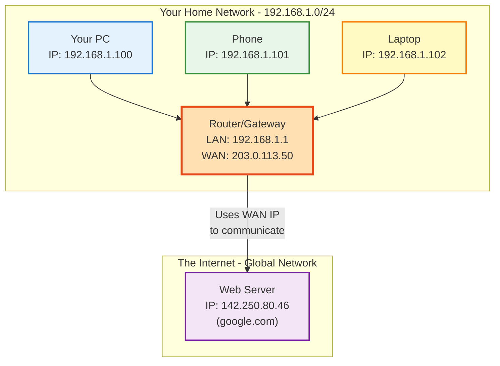
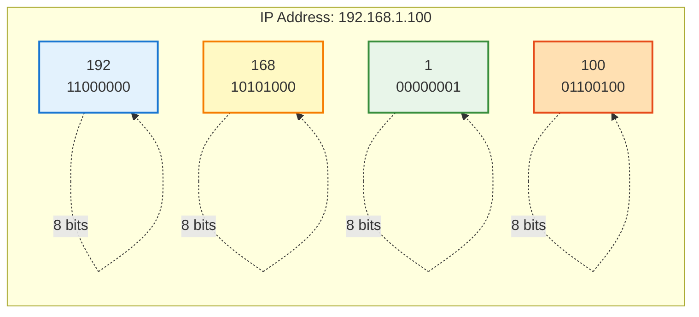
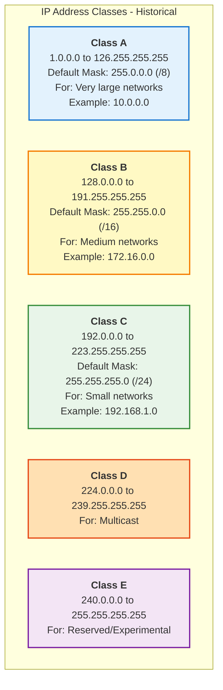
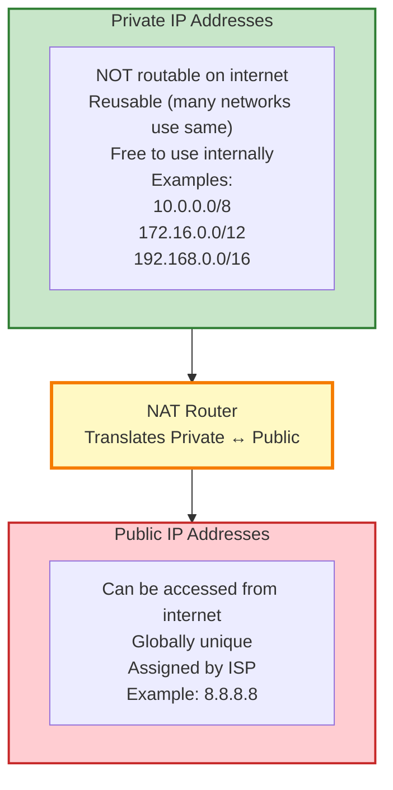
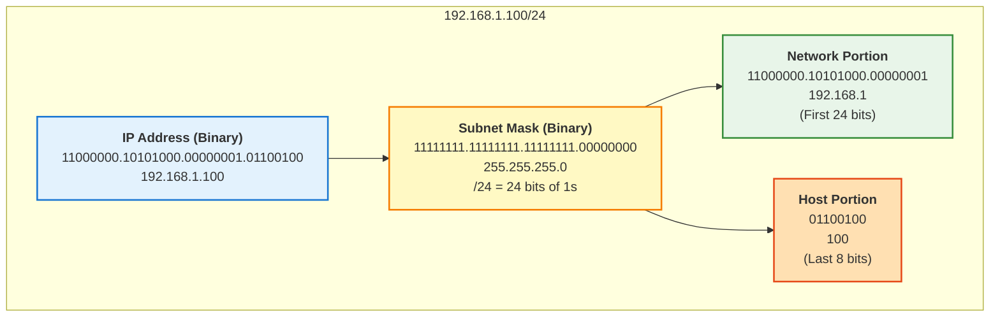
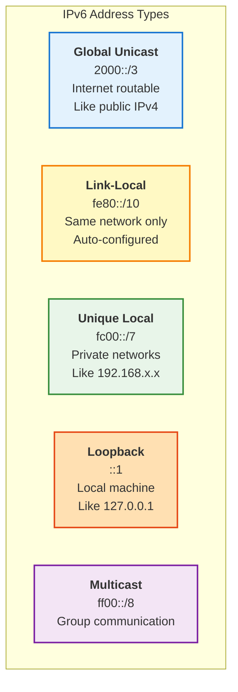

---
tags:
  - networking
  - fundamentals
  - ip-addressing
  - ipv4
  - ipv6
  - theory
  - configuration
---

# IP Addressing - Complete Guide

Comprehensive guide to understanding and configuring IP addresses in Linux networks.

---

## What is an IP Address?

An **IP (Internet Protocol) address** is a unique numerical identifier assigned to every device on a network.



**Think of it like a phone number** - you need it to communicate with devices on the network.

---

## IPv4 Addresses

### Structure

An IPv4 address consists of **4 numbers (octets)** separated by dots, each ranging from **0 to 255**.

```
192.168.1.100
 │   │   │  │
 │   │   │  └── 4th octet (0-255)
 │   │   └───── 3rd octet (0-255)
 │   └────────── 2nd octet (0-255)
 └────────────── 1st octet (0-255)
```

### Binary Representation

Each octet is actually 8 bits (binary digits).



**Decimal to Binary Conversion:**

| Decimal | Binary | Calculation |
|---------|--------|-------------|
| 192 | 11000000 | 128+64 = 192 |
| 168 | 10101000 | 128+32+8 = 168 |
| 1 | 00000001 | 1 = 1 |
| 100 | 01100100 | 64+32+4 = 100 |

**Total:** 32 bits (4 octets × 8 bits)

---

## IP Address Classes (Legacy)

Historically, IP addresses were divided into classes:



!!! note "Modern Practice"
    **Classes are mostly obsolete** - we now use CIDR (Classless Inter-Domain Routing) for more flexible addressing.

---

## Special IP Addresses

### Reserved & Private Addresses

| Range | Purpose | Usage |
|-------|---------|-------|
| **0.0.0.0** | This network | Default route |
| **127.0.0.0/8** | Loopback | Testing (localhost) |
| **10.0.0.0/8** | Private (Class A) | Large private networks |
| **172.16.0.0/12** | Private (Class B) | Medium private networks |
| **192.168.0.0/16** | Private (Class C) | Home/small networks |
| **169.254.0.0/16** | Link-Local | APIPA (auto-config failure) |
| **224.0.0.0/4** | Multicast | Group communications |
| **255.255.255.255** | Broadcast | All devices on network |

### Localhost Addresses

```bash
# All these refer to the local machine
127.0.0.1        # Standard localhost
127.0.0.2        # Also localhost
127.255.255.254  # Still localhost (entire 127.0.0.0/8)

# Test
ping 127.0.0.1
ping localhost
```

### Private vs Public IP Addresses



**Example:**
```
Your home network:
  - Router WAN: 203.0.113.50 (public)
  - Router LAN: 192.168.1.1 (private)
  - Your PC: 192.168.1.100 (private)
  
When you access the internet, your router uses NAT to translate
192.168.1.100 → 203.0.113.50
```

---

## Subnet Mask

### What is a Subnet Mask?

A subnet mask divides an IP address into **network** and **host** portions.

```
IP Address:    192.168.1.100
Subnet Mask:   255.255.255.0
               └─network─┘ └host┘
```

### Common Subnet Masks

| CIDR | Subnet Mask | Binary | Usable Hosts |
|------|-------------|--------|--------------|
| /8 | 255.0.0.0 | 11111111.00000000.00000000.00000000 | 16,777,214 |
| /16 | 255.255.0.0 | 11111111.11111111.00000000.00000000 | 65,534 |
| /24 | 255.255.255.0 | 11111111.11111111.11111111.00000000 | 254 |
| /25 | 255.255.255.128 | 11111111.11111111.11111111.10000000 | 126 |
| /26 | 255.255.255.192 | 11111111.11111111.11111111.11000000 | 62 |
| /27 | 255.255.255.224 | 11111111.11111111.11111111.11100000 | 30 |
| /28 | 255.255.255.240 | 11111111.11111111.11111111.11110000 | 14 |
| /30 | 255.255.255.252 | 11111111.11111111.11111111.11111100 | 2 |
| /32 | 255.255.255.255 | 11111111.11111111.11111111.11111111 | 1 (host route) |

### CIDR Notation

**CIDR** = Classless Inter-Domain Routing

Format: `IP_ADDRESS/PREFIX_LENGTH`

```
192.168.1.100/24
             │
             └── Prefix length (number of network bits)
```

**Examples:**
```
10.0.0.0/8        = 255.0.0.0
172.16.0.0/16     = 255.255.0.0
192.168.1.0/24    = 255.255.255.0
192.168.1.0/25    = 255.255.255.128
```

### How Subnet Mask Works



---

## Viewing IP Addresses in Linux

### Method 1: ip command (Modern)

**View all interfaces:**
```bash
ip addr show
# or short form
ip a
```

**Example output:**
```
2: ens33: <BROADCAST,MULTICAST,UP,LOWER_UP> mtu 1500
    link/ether 00:0c:29:3a:5f:c1 brd ff:ff:ff:ff:ff:ff
    inet 192.168.1.100/24 brd 192.168.1.255 scope global noprefixonly ens33
       valid_lft forever preferred_lft forever
    inet6 fe80::20c:29ff:fe3a:5fc1/64 scope link
       valid_lft forever preferred_lft forever
```

**Breaking down the output:**
- `inet 192.168.1.100/24` - IPv4 address with CIDR notation
- `brd 192.168.1.255` - Broadcast address
- `scope global` - Globally routable
- `noprefixonly` - NetworkManager specific flag

**View specific interface:**
```bash
ip addr show ens33
# or
ip a s ens33
```

**View only IPv4:**
```bash
ip -4 addr show
```

**View only IPv6:**
```bash
ip -6 addr show
```

### Method 2: ifconfig (Legacy)

```bash
ifconfig ens33
```

**Example output:**
```
ens33: flags=4163<UP,BROADCAST,RUNNING,MULTICAST>  mtu 1500
        inet 192.168.1.100  netmask 255.255.255.0  broadcast 192.168.1.255
        inet6 fe80::20c:29ff:fe3a:5fc1  prefixlen 64  scopeid 0x20<link>
        ether 00:0c:29:3a:5f:c1  txqueuelen 1000  (Ethernet)
```

### Method 3: Quick One-Liners

```bash
# Get just the IP address
ip -4 addr show ens33 | grep inet | awk '{print $2}' | cut -d'/' -f1

# Get IP and mask
ip -4 addr show ens33 | grep inet | awk '{print $2}'

# All IPs on system
hostname -I

# Primary IP
hostname -i
```

---

## Configuring IP Addresses in Linux

### Temporary Configuration (Lost on Reboot)

**Add IP address:**
```bash
sudo ip addr add 192.168.1.200/24 dev ens33
```

**Verify:**
```bash
ip addr show ens33
```

**Remove IP address:**
```bash
sudo ip addr del 192.168.1.200/24 dev ens33
```

**Flush all IPs from interface:**
```bash
sudo ip addr flush dev ens33
```

!!! warning "Temporary Only"
    These changes are lost when you reboot or restart NetworkManager.

### Persistent Configuration (NetworkManager)

#### Using nmcli (Command Line)

**Configure static IP:**
```bash
sudo nmcli connection modify ens33 \
  ipv4.method manual \
  ipv4.addresses "192.168.1.100/24" \
  ipv4.gateway "192.168.1.1" \
  ipv4.dns "8.8.8.8 8.8.4.4"

# Apply changes
sudo nmcli connection up ens33
```

**Configure DHCP:**
```bash
sudo nmcli connection modify ens33 \
  ipv4.method auto

sudo nmcli connection up ens33
```

**Add secondary IP:**
```bash
sudo nmcli connection modify ens33 \
  +ipv4.addresses "192.168.1.101/24"

sudo nmcli connection up ens33
```

**Remove secondary IP:**
```bash
sudo nmcli connection modify ens33 \
  -ipv4.addresses "192.168.1.101/24"

sudo nmcli connection up ens33
```

#### Using nmtui (Text UI)

```bash
sudo nmtui

# Navigate to:
# 1. Edit a connection
# 2. Select your connection
# 3. Edit IPv4 CONFIGURATION
# 4. Set Manual, enter IP, Gateway, DNS
# 5. OK → Back → Quit
# 6. Activate the connection
```

### Configuration Files

**NetworkManager connection files:**
```bash
/etc/NetworkManager/system-connections/ens33.nmconnection
```

**Example file content:**
```ini
[connection]
id=ens33
uuid=5fb06bd0-0bb0-7ffb-45f1-d6edd65f3e03
type=ethernet
interface-name=ens33

[ipv4]
method=manual
address1=192.168.1.100/24,192.168.1.1
dns=8.8.8.8;8.8.4.4;

[ipv6]
method=auto
```

---

## IPv6 Addresses

### Why IPv6?

**IPv4 problem:** Only 4.3 billion addresses (running out!)

**IPv6 solution:** 340 undecillion addresses (340,282,366,920,938,463,463,374,607,431,768,211,456)

### IPv6 Format

```
2001:0db8:85a3:0000:0000:8a2e:0370:7334
 │    │    │    │    │    │    │    │
 └────┴────┴────┴────┴────┴────┴────┴── 8 groups of 4 hex digits
```

### IPv6 Shortening Rules

**Original:**
```
2001:0db8:0000:0000:0000:0000:0000:0001
```

**Rule 1: Remove leading zeros in each group**
```
2001:db8:0:0:0:0:0:1
```

**Rule 2: Replace consecutive zeros with ::**
```
2001:db8::1
```

!!! note "Double Colon Rule"
    `::` can only be used **once** in an address.

**More examples:**
```
Full:       2001:0db8:0000:0042:0000:8a2e:0370:7334
Shortened:  2001:db8:0:42:0:8a2e:370:7334
More:       2001:db8:0:42::8a2e:370:7334

Full:       fe80:0000:0000:0000:0202:b3ff:fe1e:8329
Shortened:  fe80::202:b3ff:fe1e:8329

Loopback:   0000:0000:0000:0000:0000:0000:0000:0001
Shortened:  ::1
```

### IPv6 Address Types



### Viewing IPv6 in Linux

```bash
# View IPv6 addresses
ip -6 addr show

# View specific interface
ip -6 addr show ens33

# Ping IPv6 localhost
ping6 ::1

# Ping IPv6 address
ping6 fe80::20c:29ff:fe3a:5fc1%ens33
```

**Note the `%ens33`** - required for link-local addresses to specify interface.

### Configuring IPv6

**Enable IPv6:**
```bash
sudo nmcli connection modify ens33 ipv6.method auto
sudo nmcli connection up ens33
```

**Static IPv6:**
```bash
sudo nmcli connection modify ens33 \
  ipv6.method manual \
  ipv6.addresses "2001:db8::100/64" \
  ipv6.gateway "2001:db8::1"

sudo nmcli connection up ens33
```

**Disable IPv6:**
```bash
sudo nmcli connection modify ens33 ipv6.method ignore
sudo nmcli connection up ens33
```

---

## IP Address Calculation Examples

### Example 1: Home Network

**Given:**
- IP: 192.168.1.100
- Mask: 255.255.255.0 (/24)

**Calculate:**

**Network Address:** `192.168.1.0`
- First IP in range (all host bits = 0)

**Broadcast Address:** `192.168.1.255`
- Last IP in range (all host bits = 1)

**Usable Range:** `192.168.1.1` to `192.168.1.254`
- 254 usable host addresses

**Gateway (typical):** `192.168.1.1`
- First usable address

### Example 2: Smaller Network

**Given:**
- IP: 192.168.1.100
- Mask: 255.255.255.192 (/26)

**Calculate:**

**Network bits:** 26 (first 26 bits)
**Host bits:** 6 (last 6 bits)
**Hosts per subnet:** 2^6 - 2 = 62

**Binary breakdown:**
```
192.168.1.100 = 11000000.10101000.00000001.01100100
Mask /26      = 11111111.11111111.11111111.11000000
                └────────network────────┘└─host─┘
```

**Network:** `192.168.1.64` (01000000 in binary)
**Broadcast:** `192.168.1.127` (01111111 in binary)
**Range:** `192.168.1.65` to `192.168.1.126`

---

## Troubleshooting IP Address Issues

### Problem: No IP Address

**Check:**
```bash
ip addr show ens33
```

**If no IP:**
```
2: ens33: <BROADCAST,MULTICAST,UP,LOWER_UP>
    link/ether 00:0c:29:3a:5f:c1
    # No inet line!
```

**Fixes:**

**For DHCP:**
```bash
# Request IP from DHCP
sudo dhclient ens33

# Or restart NetworkManager
sudo systemctl restart NetworkManager

# Check if DHCP is configured
nmcli connection show ens33 | grep ipv4.method
```

**For Static:**
```bash
# Configure static IP
sudo nmcli connection modify ens33 \
  ipv4.method manual \
  ipv4.addresses "192.168.1.100/24" \
  ipv4.gateway "192.168.1.1"

sudo nmcli connection up ens33
```

### Problem: Wrong Subnet Mask

**Symptom:** Can ping gateway but not internet

**Check current mask:**
```bash
ip addr show ens33 | grep inet
```

**Fix:**
```bash
sudo nmcli connection modify ens33 \
  ipv4.addresses "192.168.1.100/24"

sudo nmcli connection up ens33
```

### Problem: IP Conflict

**Symptom:** Intermittent connectivity

**Check for duplicates:**
```bash
# Install arping
sudo dnf install iputils

# Check if IP is in use
sudo arping -D -I ens33 -c 2 192.168.1.100
```

**Output if conflict:**
```
ARPING 192.168.1.100 from 0.0.0.0 ens33
Unicast reply from 192.168.1.100 [00:11:22:33:44:55] 0.678ms
Sent 2 probes (1 broadcast(s))
Received 1 response(s)
```

**Fix:** Change to different IP address

---

## Quick Reference Commands

### View IP Information
```bash
# All interfaces
ip addr show
ip a

# Specific interface
ip addr show ens33

# Only IPv4
ip -4 addr

# Only IPv6
ip -6 addr

# Brief output
ip -br addr

# Just the IP (one-liner)
ip -4 addr show ens33 | grep inet | awk '{print $2}'
```

### Configure IP Address
```bash
# Temporary (lost on reboot)
sudo ip addr add 192.168.1.100/24 dev ens33
sudo ip addr del 192.168.1.100/24 dev ens33

# Permanent (NetworkManager)
sudo nmcli connection modify ens33 ipv4.addresses "192.168.1.100/24"
sudo nmcli connection up ens33
```

### Test Connectivity
```bash
# Ping localhost
ping 127.0.0.1
ping localhost

# Ping gateway
ping 192.168.1.1

# Ping external
ping 8.8.8.8
ping google.com
```

---

## IP Address Planning Tips

### Best Practices

1. **Use private addresses for internal networks:**
   - Small: `192.168.x.0/24`
   - Medium: `172.16.x.0/16`
   - Large: `10.x.0.0/8`

2. **Reserve addresses for infrastructure:**
   - `.1` for gateway/router
   - `.2-.10` for servers
   - `.11-.100` for DHCP pool
   - `.101-.254` for static devices

3. **Document your network:**
   ```
   Network: 192.168.1.0/24
   Gateway: 192.168.1.1
   DNS: 192.168.1.2
   DHCP Range: 192.168.1.11 - 192.168.1.100
   Servers: 192.168.1.10 - 192.168.1.20
   ```

4. **Use consistent subnet sizes:**
   - Don't mix /24, /25, /26 unnecessarily
   - Plan for growth

5. **Keep it simple:**
   - Use easy-to-remember addresses
   - Sequential numbering
   - Logical grouping

---

## See Also

- [Subnetting Guide](subnetting.md)
- [OSI Model](osi-model.md)
- [Network Troubleshooting](../troubleshooting/connectivity.md)
- [nmcli Commands](../commands/nmcli.md)

---

**Last Updated:** 2026-02-09  
**Difficulty:** Beginner to Intermediate  
**Estimated Time:** 45 minutes