---
tags:
  - networking
  - fundamentals
  - osi-model
  - theory
  - troubleshooting
---

# OSI Model - A Practical Guide for Developers & Linux Admins

The OSI (Open Systems Interconnection) model explained with real-world examples, tools, and troubleshooting scenarios.

---

## Visual Overview - OSI Model Stack

```mermaid
graph TD
    L7["<b>Layer 7: Application</b><br/><br/>Protocols: HTTP, HTTPS, FTP, SSH, DNS, SMTP<br/>What it does: User-facing applications and services<br/>Tools: curl, wget, ssh, dig, telnet<br/><br/>Example: Web browser, email client"]
    
    L6["<b>Layer 6: Presentation</b><br/><br/>Protocols: SSL/TLS, JPEG, ASCII, UTF-8<br/>What it does: Data formatting, encryption, compression<br/>Tools: openssl, iconv<br/><br/>Example: HTTPS encryption, image encoding"]
    
    L5["<b>Layer 5: Session</b><br/><br/>Protocols: NetBIOS, RPC, PPTP<br/>What it does: Session management and control<br/>Tools: netstat, ss, who<br/><br/>Example: SSH session, database connection"]
    
    L4["<b>Layer 4: Transport</b><br/><br/>Protocols: TCP, UDP<br/>What it does: End-to-end delivery, port numbers<br/>Tools: nc, telnet, nmap, ss<br/><br/>Example: Port 80 (HTTP), Port 443 (HTTPS)"]
    
    L3["<b>Layer 3: Network</b><br/><br/>Protocols: IP, ICMP, IGMP<br/>What it does: Routing between networks, IP addressing<br/>Tools: ping, traceroute, ip route<br/><br/>Example: 192.168.1.100 → 8.8.8.8"]
    
    L2["<b>Layer 2: Data Link</b><br/><br/>Protocols: Ethernet, ARP, PPP<br/>What it does: MAC addressing, switching<br/>Tools: ip link, arp, ethtool, bridge<br/><br/>Example: MAC: 00:0c:29:3a:5f:c1"]
    
    L1["<b>Layer 1: Physical</b><br/><br/>Components: Cables, NICs, Hubs, Repeaters<br/>What it does: Physical transmission of bits<br/>Tools: ethtool, dmesg, lspci<br/><br/>Example: Ethernet cable, WiFi radio"]
    
    L7 ==>|Data flows down through layers| L6
    L6 ==>|Each layer adds its header| L5
    L5 ==>|Encapsulation| L4
    L4 ==>|Port numbers added| L3
    L3 ==>|IP addresses added| L2
    L2 ==>|MAC addresses added| L1
    L1 -.->|Physical transmission| L1
    
    style L7 fill:#e3f2fd,stroke:#1976d2,stroke-width:3px,color:#000
    style L6 fill:#e8f5e9,stroke:#388e3c,stroke-width:3px,color:#000
    style L5 fill:#fff9c4,stroke:#f57c00,stroke-width:3px,color:#000
    style L4 fill:#ffe0b2,stroke:#e64a19,stroke-width:3px,color:#000
    style L3 fill:#f3e5f5,stroke:#7b1fa2,stroke-width:3px,color:#000
    style L2 fill:#fce4ec,stroke:#c2185b,stroke-width:3px,color:#000
    style L1 fill:#efebe9,stroke:#5d4037,stroke-width:3px,color:#000
```



---

## Quick Reference Table

| Layer | Name | What It Does | Protocols | Linux Tools |
|-------|------|--------------|-----------|-------------|
| **7** | Application | User-facing applications | HTTP, FTP, SSH, DNS, SMTP | `curl`, `wget`, `ssh`, `dig` |
| **6** | Presentation | Data formatting, encryption | SSL/TLS, JPEG, ASCII | `openssl`, `iconv` |
| **5** | Session | Manages connections/sessions | NetBIOS, RPC | `ss`, `netstat` |
| **4** | Transport | End-to-end delivery, ports | TCP, UDP | `nc`, `telnet`, `nmap` |
| **3** | Network | Routing, IP addressing | IP, ICMP, IGMP | `ping`, `traceroute`, `ip` |
| **2** | Data Link | MAC addressing, switching | Ethernet, ARP | `ip link`, `arp`, `bridge` |
| **1** | Physical | Physical transmission | Cables, NICs, WiFi | `ethtool`, `dmesg`, `lspci` |

---

## Layer-by-Layer Deep Dive

### Layer 1: Physical Layer 🔌

**What it does:** Transmits raw bits (0s and 1s) over physical medium.

**Think of it as:** The actual cables, network cards, and electrical signals.

#### Real-World Components
- Network cables (Ethernet, fiber optic)
- Network Interface Cards (NICs)
- Hubs
- Repeaters
- WiFi radio signals

#### Linux Tools & Commands

```bash
# Check physical interface status
ethtool ens33

# Example output:
# Settings for ens33:
#     Link detected: yes
#     Speed: 1000Mb/s
#     Duplex: Full
```

**What to check:**
```bash
# View all network interfaces
ip link show

# Check if cable is physically connected
ethtool ens33 | grep "Link detected"

# View kernel messages for hardware issues
dmesg | grep -i eth
dmesg | grep -i network

# List PCI network devices
lspci | grep -i network
```

#### Common Issues & Fixes

??? question "Cable not detected?"
    **Symptom:** `Link detected: no`
    
    **Troubleshooting:**
    ```bash
    # Check physical connection
    ethtool ens33 | grep "Link detected"
    
    # Try different cable
    # Check for port lights on NIC and switch
    ```

??? question "Slow speed (10Mb instead of 1000Mb)?"
    **Check negotiation:**
    ```bash
    ethtool ens33 | grep -i speed
    
    # Force speed (if needed)
    sudo ethtool -s ens33 speed 1000 duplex full autoneg off
    ```

**Tags:** `#physical-layer` `#hardware` `#cables`

---

### Layer 2: Data Link Layer 🔗

**What it does:** Handles MAC addressing and switching within local network.

**Think of it as:** How devices on the same network find each other using MAC addresses.

#### Real-World Components
- MAC addresses (e.g., `00:0c:29:xx:xx:xx`)
- Switches
- Bridges
- VLANs
- ARP (Address Resolution Protocol)

#### Key Concepts

**MAC Address:** Hardware address burned into network card
```
Example: 00:0c:29:3a:5f:c1
         [OUI]  [NIC specific]
```

**Frame Structure:**
```
[Destination MAC][Source MAC][Type][Data][CRC]
```

#### Linux Tools & Commands

```bash
# View MAC address of interface
ip link show ens33

# Example output:
# 2: ens33: <BROADCAST,MULTICAST,UP,LOWER_UP>
#     link/ether 00:0c:29:3a:5f:c1

# View ARP table (IP to MAC mapping)
ip neigh show
# or
arp -n

# Example output:
# 192.168.1.1 dev ens33 lladdr aa:bb:cc:dd:ee:ff REACHABLE
```

**Advanced commands:**
```bash
# Add static ARP entry
sudo ip neigh add 192.168.1.100 lladdr 00:11:22:33:44:55 dev ens33

# Delete ARP entry
sudo ip neigh del 192.168.1.100 dev ens33

# View MAC address table (if running bridge)
bridge fdb show

# Check switch port statistics
ethtool -S ens33
```

#### Packet Flow Diagram

```mermaid
graph TD
    PC1["<b>Computer A</b><br/>IP: 192.168.1.10<br/>MAC: AA:AA:AA:AA:AA:AA"]
    
    SW["<b>Switch</b><br/>Learns MAC addresses<br/>Forwards to correct port<br/><br/>MAC Table:<br/>Port 1 → AA:AA:AA:AA:AA:AA<br/>Port 2 → BB:BB:BB:BB:BB:BB"]
    
    PC2["<b>Server B</b><br/>IP: 192.168.1.20<br/>MAC: BB:BB:BB:BB:BB:BB"]
    
    PC1 -->|"Ethernet Frame<br/>Dest MAC: BB:BB:BB:BB:BB:BB<br/>Src MAC: AA:AA:AA:AA:AA:AA<br/>Data: Hello Server!"| SW
    
    SW -->|"Switch looks up<br/>BB:BB:BB:BB:BB:BB in table<br/>Forwards to Port 2"| PC2
    
    PC2 -.->|"Response Frame<br/>Dest: AA:AA:AA:AA:AA:AA<br/>Src: BB:BB:BB:BB:BB:BB"| SW
    
    SW -.->|"Forwards to Port 1"| PC1
    
    style PC1 fill:#e3f2fd,stroke:#1976d2,stroke-width:2px
    style SW fill:#fff9c4,stroke:#f57c00,stroke-width:3px
    style PC2 fill:#e8f5e9,stroke:#388e3c,stroke-width:2px
```



#### Common Issues & Fixes

??? question "How to find MAC address of remote device?"
    **Command:**
    ```bash
    # Ping first to populate ARP table
    ping -c 1 192.168.1.100
    
    # Then check ARP
    arp -n | grep 192.168.1.100
    # or
    ip neigh show 192.168.1.100
    ```

??? question "Duplicate MAC address on network?"
    **Symptoms:** Intermittent connectivity
    
    **Check:**
    ```bash
    # Look for duplicate entries in ARP
    arp -n | sort
    
    # Monitor for ARP conflicts
    sudo tcpdump -i ens33 arp
    ```

**Tags:** `#data-link` `#mac-address` `#arp` `#switching`

---

### Layer 3: Network Layer 🌐

**What it does:** Handles IP addressing and routing between different networks.

**Think of it as:** How data travels between different networks (your home to Google's servers).

#### Real-World Components
- IP addresses (IPv4, IPv6)
- Routers
- Routing protocols
- ICMP (ping, traceroute)

#### Key Concepts

**IPv4 Address Structure:**
```
192.168.1.100/24
│   │   │ │   └── Host part
│   │   │ └────── Network part
└───┴───┴──────── Network portion
        └──────── /24 = 255.255.255.0 subnet mask
```

**Routing Decision:**
```
Question: Where should this packet go?
Answer: Check routing table!
```

#### Linux Tools & Commands

```bash
# View IP address
ip addr show ens33

# View routing table
ip route show

# Example output:
# default via 192.168.1.1 dev ens33 proto static metric 100
# 192.168.1.0/24 dev ens33 proto kernel scope link src 192.168.1.100
```

**Routing operations:**
```bash
# Add route
sudo ip route add 10.0.0.0/8 via 192.168.1.1

# Delete route
sudo ip route del 10.0.0.0/8

# Show route to specific destination
ip route get 8.8.8.8

# Trace packet path
traceroute google.com
# or
mtr google.com
```

**ICMP (Ping) - The Layer 3 Diagnostic Tool:**
```bash
# Basic ping
ping -c 4 8.8.8.8

# Ping with size
ping -c 4 -s 1472 8.8.8.8

# Ping with TTL
ping -c 4 -t 64 8.8.8.8
```

#### Routing Flow Diagram


#### Common Issues & Fixes

??? question "Can ping IP but not domain name?"
    **Issue:** Layer 3 works, but DNS (Layer 7) doesn't
    
    **Test:**
    ```bash
    # This works:
    ping -c 4 8.8.8.8
    
    # This fails:
    ping -c 4 google.com
    
    # Fix DNS:
    cat /etc/resolv.conf
    # Add nameserver if missing
    ```

??? question "Packets not reaching destination?"
    **Trace the path:**
    ```bash
    traceroute 8.8.8.8
    
    # Shows each hop:
    # 1  192.168.1.1 (gateway)
    # 2  10.0.0.1 (ISP)
    # 3  * * * (timeout - firewall blocking?)
    ```

??? question "No default gateway?"
    **Check and fix:**
    ```bash
    # Check current routes
    ip route show | grep default
    
    # If missing, add it:
    sudo ip route add default via 192.168.1.1
    
    # Make persistent:
    sudo nmcli connection modify ens33 ipv4.gateway "192.168.1.1"
    ```

**Tags:** `#network-layer` `#ip-addressing` `#routing` `#icmp`

---

### Layer 4: Transport Layer 🚚

**What it does:** Manages end-to-end communication, ports, and reliability.

**Think of it as:** Delivery service - TCP is registered mail (reliable), UDP is regular mail (fast but no guarantee).

#### Protocols

**TCP (Transmission Control Protocol):**
- ✅ Reliable delivery
- ✅ Ordered packets
- ✅ Error checking
- ❌ Slower
- **Use for:** Web (HTTP), Email, File transfers

**UDP (User Datagram Protocol):**
- ✅ Fast
- ✅ Low overhead
- ❌ No delivery guarantee
- ❌ No ordering
- **Use for:** DNS, Video streaming, Gaming, VoIP

#### Port Numbers

**Well-Known Ports (0-1023):**
```
22   - SSH
80   - HTTP
443  - HTTPS
3306 - MySQL
5432 - PostgreSQL
```

**Registered Ports (1024-49151):**
```
8080 - Alternative HTTP
3000 - Node.js/React dev
8443 - Alternative HTTPS
```

#### Linux Tools & Commands

```bash
# Show listening ports (TCP & UDP)
ss -tuln

# Example output:
# tcp   LISTEN  0  128  0.0.0.0:22     0.0.0.0:*
# tcp   LISTEN  0  128  0.0.0.0:80     0.0.0.0:*
# udp   UNCONN  0  0    0.0.0.0:53     0.0.0.0:*
```

**Connection states:**
```bash
# Show all connections with processes
ss -tunap

# Show only established connections
ss -tun state established

# Count connections per state
ss -tan | awk '{print $1}' | sort | uniq -c
```

**Testing connectivity:**
```bash
# Test TCP port (HTTP)
nc -zv google.com 80
# or
telnet google.com 80

# Test UDP port (DNS)
nc -zvu 8.8.8.8 53

# Scan ports
nmap -p 80,443 example.com
```

#### TCP Three-Way Handshake


#### Common Issues & Fixes

??? question "Port already in use?"
    **Find what's using it:**
    ```bash
    # Find process using port 8080
    sudo lsof -i :8080
    # or
    sudo ss -tulnp | grep :8080
    
    # Example output:
    # tcp  LISTEN  0  128  *:8080  *:*  users:(("node",pid=1234))
    
    # Kill if needed:
    sudo kill 1234
    ```

??? question "Connection refused vs timeout?"
    **Connection Refused:**
    - Port is closed or nothing listening
    - Firewall actively rejecting
    
    ```bash
    telnet localhost 9999
    # Trying 127.0.0.1...
    # telnet: Unable to connect: Connection refused
    ```
    
    **Connection Timeout:**
    - Firewall dropping packets
    - Service unreachable
    
    ```bash
    telnet 10.0.0.1 22
    # Trying 10.0.0.1...
    # (hangs, then times out)
    ```

??? question "Too many open connections?"
    **Check limits:**
    ```bash
    # View current connections
    ss -s
    
    # Check system limits
    ulimit -n
    cat /proc/sys/fs/file-max
    
    # Increase limits if needed
    sudo sysctl -w net.core.somaxconn=1024
    ```

**Tags:** `#transport-layer` `#tcp` `#udp` `#ports`

---

### Layer 5: Session Layer 🔐

**What it does:** Manages sessions and maintains connections between applications.

**Think of it as:** Keeping track of your login session on a website or SSH connection.

#### Real-World Examples
- SSH sessions
- Database connections
- RPC (Remote Procedure Calls)
- NetBIOS sessions

#### Linux Tools & Commands

```bash
# View active sessions/connections
ss -tunap

# View SSH sessions
who
w

# Example output of 'w':
# USER     TTY      FROM             LOGIN@   IDLE   WHAT
# admin    pts/0    192.168.1.50     10:30    0.00s  w
# user1    pts/1    192.168.1.51     11:15    5:00   vim file.txt
```

**Session management:**
```bash
# View current SSH connections
ss -tunap | grep :22

# List all logged in users
who -a

# View user login history
last -n 10

# Kill a user session
sudo pkill -u username
```

**Database connection pooling (session layer concept):**
```bash
# View MySQL connections (sessions)
mysql -e "SHOW PROCESSLIST;"

# PostgreSQL sessions
psql -c "SELECT * FROM pg_stat_activity;"
```

#### Session Example: SSH


#### Common Issues & Fixes

??? question "SSH session keeps timing out?"
    **Fix with keep-alive:**
    
    **Client side (`~/.ssh/config`):**
    ```bash
    Host *
        ServerAliveInterval 60
        ServerAliveCountMax 3
    ```
    
    **Server side (`/etc/ssh/sshd_config`):**
    ```bash
    ClientAliveInterval 60
    ClientAliveCountMax 3
    ```

??? question "Too many sessions open?"
    **Check and limit:**
    ```bash
    # View all sessions
    who | wc -l
    
    # Set max sessions per user
    # In /etc/security/limits.conf:
    # username hard maxlogins 3
    ```

**Tags:** `#session-layer` `#ssh` `#connections`

---

### Layer 6: Presentation Layer 🎨

**What it does:** Data formatting, encryption, compression, character encoding.

**Think of it as:** Translator - makes sure data is in the right format for the application.

#### Functions
- **Encryption/Decryption:** SSL/TLS
- **Compression:** gzip, deflate
- **Data conversion:** ASCII, UTF-8, JPEG, PNG
- **Serialization:** JSON, XML, Protocol Buffers

#### Real-World Examples

**SSL/TLS Encryption:**
```
HTTP (plain text) → HTTPS (encrypted via SSL/TLS)
```

**Data Encoding:**
```
UTF-8 text → Base64 encoding → Transfer → Base64 decoding → UTF-8 text
```

#### Linux Tools & Commands

```bash
# Check SSL/TLS certificate
openssl s_client -connect google.com:443

# View certificate details
echo | openssl s_client -connect google.com:443 2>/dev/null | openssl x509 -noout -dates

# Example output:
# notBefore=Jan  1 00:00:00 2024 GMT
# notAfter=Mar 31 23:59:59 2024 GMT
```

**Compression/Decompression:**
```bash
# Compress file
gzip file.txt

# Decompress
gunzip file.txt.gz

# Compress with tar
tar -czf archive.tar.gz /path/to/directory
```

**Character encoding:**
```bash
# Convert between encodings
iconv -f UTF-8 -t ASCII//TRANSLIT input.txt > output.txt

# Check file encoding
file -bi filename
```

**SSL/TLS Testing:**
```bash
# Test SSL connection
curl -v https://example.com

# Check SSL protocols supported
nmap --script ssl-enum-ciphers -p 443 example.com
```

#### Encryption Flow Diagram

```mermaid
graph TD
    A["<b>Step 1: Application Layer</b><br/>Your browser sends:<br/>'username=admin&password=secret'<br/>(Plain text data)"]
    
    B["<b>Step 2: Presentation Layer</b><br/>SSL/TLS Encryption Applied<br/>Plain text → Encrypted ciphertext<br/>Using AES-256, RSA keys"]
    
    C["<b>Step 3: Network Transmission</b><br/>Encrypted data sent over network<br/>Anyone intercepting sees gibberish<br/>🔒 Safe from eavesdropping"]
    
    D["<b>Step 4: Receiving End</b><br/>Presentation Layer<br/>Decrypts using private key<br/>Ciphertext → Plain text"]
    
    E["<b>Step 5: Application Receives</b><br/>Server application gets:<br/>'username=admin&password=secret'<br/>(Original plain text)"]
    
    A ==>|"Data goes down<br/>through layers"| B
    B ==>|"Encrypted payload"| C
    C ==>|"Over the wire"| D
    D ==>|"Decrypted data<br/>goes up layers"| E
    
    style A fill:#e3f2fd,stroke:#1976d2,stroke-width:2px
    style B fill:#e8f5e9,stroke:#388e3c,stroke-width:3px
    style C fill:#fff9c4,stroke:#f57c00,stroke-width:2px
    style D fill:#e8f5e9,stroke:#388e3c,stroke-width:3px
    style E fill:#e3f2fd,stroke:#1976d2,stroke-width:2px
```



#### Common Issues & Fixes

??? question "SSL certificate errors?"
    **Check certificate:**
    ```bash
    # View full certificate chain
    openssl s_client -connect example.com:443 -showcerts
    
    # Check expiration
    echo | openssl s_client -connect example.com:443 2>/dev/null | \
    openssl x509 -noout -dates
    
    # Test specific SSL version
    openssl s_client -connect example.com:443 -tls1_2
    ```

??? question "Character encoding issues?"
    **Detect and convert:**
    ```bash
    # Detect encoding
    file -bi file.txt
    
    # Convert UTF-8 to ASCII
    iconv -f UTF-8 -t ASCII//TRANSLIT input.txt > output.txt
    ```

**Tags:** `#presentation-layer` `#ssl` `#encryption` `#encoding`

---

### Layer 7: Application Layer 📱

**What it does:** User-facing network services and protocols.

**Think of it as:** The apps you actually use - web browsers, email clients, file transfers.

#### Common Protocols

| Protocol | Port | Purpose | Example |
|----------|------|---------|---------|
| HTTP | 80 | Web traffic | `curl http://example.com` |
| HTTPS | 443 | Secure web | `curl https://example.com` |
| SSH | 22 | Secure shell | `ssh user@server` |
| FTP | 21 | File transfer | `ftp server` |
| DNS | 53 | Name resolution | `dig example.com` |
| SMTP | 25 | Send email | `telnet mail.server 25` |
| IMAP | 143 | Receive email | Email client |
| MySQL | 3306 | Database | `mysql -h host -u user -p` |
| PostgreSQL | 5432 | Database | `psql -h host -U user` |

#### Linux Tools & Commands

**HTTP/HTTPS:**
```bash
# Make HTTP request
curl http://example.com

# Make HTTPS request with headers
curl -v https://api.example.com

# POST request
curl -X POST -d "data=value" https://api.example.com

# Download file
wget https://example.com/file.zip
```

**DNS:**
```bash
# Query DNS
dig example.com

# Reverse DNS
dig -x 8.8.8.8

# Query specific DNS server
dig @8.8.8.8 example.com

# Trace DNS resolution
dig +trace example.com
```

**SSH:**
```bash
# Connect to server
ssh user@192.168.1.100

# With specific key
ssh -i ~/.ssh/id_rsa user@server

# Port forwarding
ssh -L 8080:localhost:80 user@server

# Run command without interactive shell
ssh user@server 'ls -la'
```

**Email (SMTP test):**
```bash
# Test SMTP server
telnet mail.example.com 25

# Send test email
HELO example.com
MAIL FROM: sender@example.com
RCPT TO: recipient@example.com
DATA
Subject: Test
This is a test.
.
QUIT
```

#### HTTP Request Flow


#### Common Issues & Fixes

??? question "HTTP 404 Not Found?"
    **Check URL and path:**
    ```bash
    # Test with curl
    curl -v http://example.com/missing-page
    
    # Output shows:
    # < HTTP/1.1 404 Not Found
    
    # The resource doesn't exist on server
    ```

??? question "DNS not resolving?"
    **Test DNS:**
    ```bash
    # Query domain
    dig example.com
    
    # If fails, try different DNS server
    dig @8.8.8.8 example.com
    
    # Check /etc/resolv.conf
    cat /etc/resolv.conf
    ```

??? question "Can't connect to database?"
    **Test connection:**
    ```bash
    # Test MySQL port
    nc -zv mysql-server 3306
    
    # Test PostgreSQL
    nc -zv pg-server 5432
    
    # Try connecting
    mysql -h mysql-server -u user -p
    psql -h pg-server -U user -d database
    ```

**Tags:** `#application-layer` `#http` `#dns` `#ssh` `#smtp`

---

## Complete Troubleshooting Workflow

### Bottom-Up Approach (Recommended)

```mermaid
graph TD
    Start["<b>🔴 Network Problem Detected</b><br/>Start troubleshooting from Layer 1"]
    
    L1{"<b>Layer 1: Physical</b><br/>Is cable connected?<br/>Link light on?<br/>NIC detected?"}
    
    FixL1["<b>FIX Layer 1:</b><br/>✓ Check cable connection<br/>✓ Try different cable<br/>✓ Check NIC LED lights<br/>✓ Test different port<br/>Commands: ethtool, dmesg"]
    
    L2{"<b>Layer 2: Data Link</b><br/>Interface UP?<br/>Can see MAC address?<br/>ARP working?"}
    
    FixL2["<b>FIX Layer 2:</b><br/>✓ Bring interface up<br/>✓ Check switch connection<br/>✓ Verify MAC address<br/>✓ Check ARP table<br/>Commands: ip link, arp"]
    
    L3{"<b>Layer 3: Network</b><br/>Have IP address?<br/>Can ping gateway?<br/>Routing table OK?"}
    
    FixL3["<b>FIX Layer 3:</b><br/>✓ Configure IP address<br/>✓ Add default route<br/>✓ Check gateway reachable<br/>✓ Verify subnet mask<br/>Commands: ip addr, ping, ip route"]
    
    L4{"<b>Layer 4: Transport</b><br/>Is port open?<br/>Service listening?<br/>Firewall blocking?"}
    
    FixL4["<b>FIX Layer 4:</b><br/>✓ Start service<br/>✓ Open firewall port<br/>✓ Check if port in use<br/>✓ Verify process listening<br/>Commands: ss, netstat, firewall-cmd"]
    
    L7{"<b>Layer 7: Application</b><br/>Application responding?<br/>Correct protocol?<br/>Authentication OK?"}
    
    FixL7["<b>FIX Layer 7:</b><br/>✓ Check app logs<br/>✓ Verify configuration<br/>✓ Test with curl/telnet<br/>✓ Check DNS resolution<br/>Commands: curl, dig, journalctl"]
    
    Fixed["<b>✅ Problem Solved!</b><br/>Network is working"]
    
    Start --> L1
    L1 -->|"❌ NO"| FixL1
    L1 -->|"✅ YES"| L2
    FixL1 -->|"Try again"| L1
    
    L2 -->|"❌ NO"| FixL2
    L2 -->|"✅ YES"| L3
    FixL2 -->|"Try again"| L2
    
    L3 -->|"❌ NO"| FixL3
    L3 -->|"✅ YES"| L4
    FixL3 -->|"Try again"| L3
    
    L4 -->|"❌ NO"| FixL4
    L4 -->|"✅ YES"| L7
    FixL4 -->|"Try again"| L4
    
    L7 -->|"❌ NO"| FixL7
    L7 -->|"✅ YES"| Fixed
    FixL7 -->|"Try again"| L7
    
    style Start fill:#ffcdd2,stroke:#c62828,stroke-width:3px
    style Fixed fill:#c8e6c9,stroke:#2e7d32,stroke-width:3px
    style L1 fill:#e3f2fd,stroke:#1976d2,stroke-width:2px
    style L2 fill:#f3e5f5,stroke:#7b1fa2,stroke-width:2px
    style L3 fill:#fff9c4,stroke:#f57c00,stroke-width:2px
    style L4 fill:#ffe0b2,stroke:#e64a19,stroke-width:2px
    style L7 fill:#e8f5e9,stroke:#388e3c,stroke-width:2px
    style FixL1 fill:#ffebee,stroke:#c62828,stroke-width:1px
    style FixL2 fill:#fce4ec,stroke:#c2185b,stroke-width:1px
    style FixL3 fill:#fffde7,stroke:#f57c00,stroke-width:1px
    style FixL4 fill:#fff3e0,stroke:#e64a19,stroke-width:1px
    style FixL7 fill:#f1f8e9,stroke:#558b2f,stroke-width:1px
```



### Diagnostic Commands by Layer

```bash
#!/bin/bash
# Network diagnostic script - bottom to top

echo "=== Layer 1: Physical ==="
ethtool ens33 | grep "Link detected"
ip link show ens33

echo "=== Layer 2: Data Link ==="
ip link show ens33 | grep "link/ether"
ip neigh show

echo "=== Layer 3: Network ==="
ip addr show ens33
ip route show
ping -c 2 192.168.1.1  # gateway

echo "=== Layer 4: Transport ==="
ss -tuln

echo "=== Layer 7: Application ==="
curl -I http://example.com
dig google.com +short
```

---

## Real-World Scenarios

### Scenario 1: Website Not Loading

**Symptom:** Can't access https://example.com

**Troubleshoot:**

```bash
# 1. Check Physical (L1)
ip link show
# Status: UP ✓

# 2. Check Data Link (L2)
ip addr show
# Has IP ✓

# 3. Check Network (L3)
ping 8.8.8.8
# Can ping ✓

ping example.com
# Can't ping ✗

# 4. Check DNS (L7)
dig example.com
# SERVFAIL ✗

# SOLUTION: DNS issue
# Fix: Change DNS server
sudo nmcli connection modify ens33 ipv4.dns "8.8.8.8"
sudo nmcli connection up ens33
```

---

### Scenario 2: SSH Connection Refused

**Symptom:** `ssh user@server` gives "Connection refused"

**Troubleshoot:**

```bash
# 1. Can we reach the server? (L3)
ping server
# Ping works ✓

# 2. Is port 22 open? (L4)
nc -zv server 22
# Connection refused ✗

# Check on server:
sudo ss -tuln | grep :22
# Nothing listening ✗

# SOLUTION: SSH service not running
sudo systemctl start sshd
sudo systemctl enable sshd
```

---

### Scenario 3: Slow Website Performance

**Symptom:** Website loads but very slowly

**Troubleshoot:**

```bash
# 1. Check latency (L3)
ping -c 10 example.com
# High latency (200ms+) ✗

# 2. Trace route (L3)
traceroute example.com
# Shows congestion at ISP hop

# 3. Check MTU (L2/L3)
ping -c 4 -M do -s 1472 example.com
# Fragmentation needed ✗

# SOLUTION: MTU issue
sudo ip link set dev ens33 mtu 1400
```

---

## Summary for Developers

### What You Need to Know

**As a Developer:**

1. **Layer 7 (Application):** Your code lives here
   - HTTP/HTTPS APIs
   - Database connections
   - WebSockets
   
2. **Layer 4 (Transport):** Port numbers matter
   - Your app listens on specific ports
   - TCP for reliability, UDP for speed
   
3. **Layer 3 (Network):** IP addresses and routing
   - Localhost: `127.0.0.1`
   - Private networks: `192.168.x.x`, `10.x.x.x`

**Common Dev Tasks by Layer:**

```bash
# Check if your app is listening (L4)
ss -tuln | grep :3000

# Test your API endpoint (L7)
curl http://localhost:3000/api/health

# Check database connection (L7 over L4)
nc -zv mysql-host 3306

# Test DNS resolution (L7)
dig api.example.com
```

---

## Summary for Linux Admins

### Troubleshooting Checklist

**Bottom-up approach:**

```bash
# ✓ Layer 1: Physical
ethtool ens33 | grep "Link detected: yes"

# ✓ Layer 2: Data Link
ip link show | grep "state UP"
ip neigh show  # ARP table populated?

# ✓ Layer 3: Network
ip addr show  # Has IP?
ip route show  # Has default route?
ping 8.8.8.8  # Can reach internet?

# ✓ Layer 4: Transport
ss -tuln  # Ports listening?
nc -zv host port  # Port reachable?

# ✓ Layer 7: Application
systemctl status service  # Service running?
curl -v http://endpoint  # App responding?
```

---

## Quick Reference: Layer Mnemonic

**Remember the layers:**

```
Please Do Not Throw Sausage Pizza Away

P - Physical (Layer 1)
D - Data Link (Layer 2)
N - Network (Layer 3)
T - Transport (Layer 4)
S - Session (Layer 5)
P - Presentation (Layer 6)
A - Application (Layer 7)
```

**Or reversed (top-down):**

```
All People Seem To Need Data Processing

A - Application (Layer 7)
P - Presentation (Layer 6)
S - Session (Layer 5)
T - Transport (Layer 4)
N - Network (Layer 3)
D - Data Link (Layer 2)
P - Physical (Layer 1)
```

---

## Further Reading

- [IP Command Reference](../commands/ip-command.md)
- [Network Troubleshooting Guide](../troubleshooting/connectivity.md)
- [Firewall Configuration](../../rhel/configuration/firewall.md)

---

**Last Updated:** 2024-02-09  
**Complexity Level:** Intermediate  
**Estimated Reading Time:** 30 minutes
