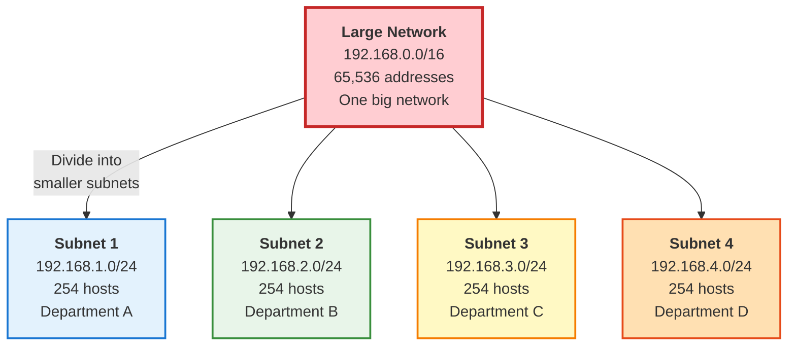
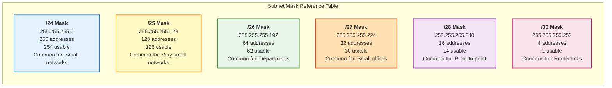
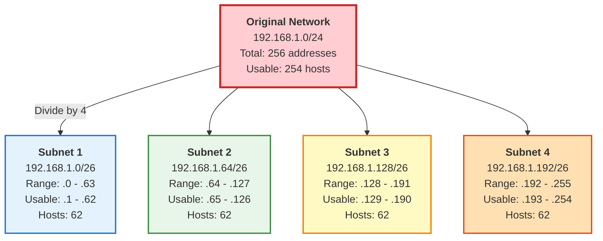
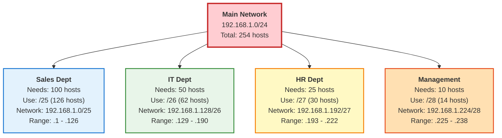

---
tags:
  - networking
  - fundamentals
  - subnetting
  - cidr
  - network-design
  - theory
  - calculation
---

# Subnetting - Complete Guide

Master the art of subnetting: divide networks efficiently, calculate IP ranges, and design network infrastructure.

---

## What is Subnetting?

**Subnetting** is dividing a large network into smaller, manageable sub-networks (subnets).



### Why Subnet?

1. **Improve Performance** - Less broadcast traffic
2. **Better Security** - Isolate departments/functions
3. **Efficient IP Usage** - Use only what you need
4. **Easier Management** - Smaller, logical groups
5. **Network Organization** - Separate by location/function

---

## Subnet Mask Basics

### Understanding the Mask

A subnet mask separates network bits from host bits.

```
IP Address:    192.168.1.100
Subnet Mask:   255.255.255.0
               └─Network──┘ └Host┘
```

### Subnet Mask Table



### Complete Subnet Mask Chart

| CIDR | Subnet Mask | Binary Notation | Total IPs | Usable IPs | Typical Use |
|------|-------------|-----------------|-----------|------------|-------------|
| /8 | 255.0.0.0 | 11111111.00000000.00000000.00000000 | 16,777,216 | 16,777,214 | Massive networks |
| /16 | 255.255.0.0 | 11111111.11111111.00000000.00000000 | 65,536 | 65,534 | Large enterprise |
| /17 | 255.255.128.0 | 11111111.11111111.10000000.00000000 | 32,768 | 32,766 | Large divisions |
| /18 | 255.255.192.0 | 11111111.11111111.11000000.00000000 | 16,384 | 16,382 | Medium enterprise |
| /19 | 255.255.224.0 | 11111111.11111111.11100000.00000000 | 8,192 | 8,190 | Medium divisions |
| /20 | 255.255.240.0 | 11111111.11111111.11110000.00000000 | 4,096 | 4,094 | Small enterprise |
| /21 | 255.255.248.0 | 11111111.11111111.11111000.00000000 | 2,048 | 2,046 | Small divisions |
| /22 | 255.255.252.0 | 11111111.11111111.11111100.00000000 | 1,024 | 1,022 | Multiple buildings |
| /23 | 255.255.254.0 | 11111111.11111111.11111110.00000000 | 512 | 510 | Single building |
| /24 | 255.255.255.0 | 11111111.11111111.11111111.00000000 | 256 | 254 | **Standard LAN** |
| /25 | 255.255.255.128 | 11111111.11111111.11111111.10000000 | 128 | 126 | Small department |
| /26 | 255.255.255.192 | 11111111.11111111.11111111.11000000 | 64 | 62 | Small office |
| /27 | 255.255.255.224 | 11111111.11111111.11111111.11100000 | 32 | 30 | Tiny network |
| /28 | 255.255.255.240 | 11111111.11111111.11111111.11110000 | 16 | 14 | Very small |
| /29 | 255.255.255.248 | 11111111.11111111.11111111.11111000 | 8 | 6 | Minimal |
| /30 | 255.255.255.252 | 11111111.11111111.11111111.11111100 | 4 | 2 | **Point-to-point** |
| /31 | 255.255.255.254 | 11111111.11111111.11111111.11111110 | 2 | 2 | Special P2P |
| /32 | 255.255.255.255 | 11111111.11111111.11111111.11111111 | 1 | 1 | Single host |

---

## Subnetting Calculation Method

### The Magic Number Method

**Step 1:** Identify the interesting octet
**Step 2:** Calculate the magic number
**Step 3:** List the subnets
**Step 4:** Calculate ranges

#### Example 1: Subnet 192.168.1.0/26

**Given:** Network 192.168.1.0/26

**Step 1: Interesting Octet**
```
/26 = 255.255.255.192
                   └── 4th octet (192)
```

**Step 2: Magic Number**
```
Magic Number = 256 - interesting octet value
             = 256 - 192
             = 64
```

**Step 3: List Subnets (increment by magic number)**
```
Subnet 1: 192.168.1.0
Subnet 2: 192.168.1.64
Subnet 3: 192.168.1.128
Subnet 4: 192.168.1.192
Next:     192.168.1.256 (invalid - stops at 255)
```

**Step 4: Calculate Ranges**

| Subnet | Network Address | First Usable | Last Usable | Broadcast | Hosts |
|--------|----------------|--------------|-------------|-----------|-------|
| 1 | 192.168.1.0 | 192.168.1.1 | 192.168.1.62 | 192.168.1.63 | 62 |
| 2 | 192.168.1.64 | 192.168.1.65 | 192.168.1.126 | 192.168.1.127 | 62 |
| 3 | 192.168.1.128 | 192.168.1.129 | 192.168.1.190 | 192.168.1.191 | 62 |
| 4 | 192.168.1.192 | 192.168.1.193 | 192.168.1.254 | 192.168.1.255 | 62 |

#### Example 2: Subnet 10.0.0.0/22

**Given:** Network 10.0.0.0/22

**Step 1: Interesting Octet**
```
/22 = 255.255.252.0
               └── 3rd octet (252)
```

**Step 2: Magic Number**
```
Magic Number = 256 - 252 = 4
```

**Step 3: List Subnets**
```
Subnet 1: 10.0.0.0
Subnet 2: 10.0.4.0
Subnet 3: 10.0.8.0
Subnet 4: 10.0.12.0
... (continues)
```

**Step 4: First Subnet Details**
```
Network:    10.0.0.0
First Host: 10.0.0.1
Last Host:  10.0.3.254
Broadcast:  10.0.3.255
Total Hosts: 1022 usable
```

---

## Visual Subnetting Examples

### Example: Dividing /24 into /26



### Binary Subnetting Visualization

**Network:** 192.168.1.0/26

```
Original /24:
11000000.10101000.00000001.00000000 = 192.168.1.0
11111111.11111111.11111111.00000000 = 255.255.255.0
└────────network──────────┘└─host──┘

After Subnetting to /26:
11000000.10101000.00000001.00000000 = 192.168.1.0
11111111.11111111.11111111.11000000 = 255.255.255.192
└────────network──────────┘└subnet┘└host┘

Subnet bits borrowed: 2
Number of subnets: 2^2 = 4
Hosts per subnet: 2^6 - 2 = 62
```

---

## VLSM (Variable Length Subnet Masking)

**VLSM** allows using different subnet masks within the same network for efficiency.

### VLSM Example

**Scenario:** Company with different department sizes



### VLSM Allocation Table

| Department | Hosts Needed | Subnet Chosen | Network | Range | Hosts Available |
|------------|--------------|---------------|---------|-------|-----------------|
| Sales | 100 | /25 | 192.168.1.0/25 | .1 - .126 | 126 |
| IT | 50 | /26 | 192.168.1.128/26 | .129 - .190 | 62 |
| HR | 25 | /27 | 192.168.1.192/27 | .193 - .222 | 30 |
| Management | 10 | /28 | 192.168.1.224/28 | .225 - .238 | 14 |
| Spare | - | /28 | 192.168.1.240/28 | .241 - .254 | 14 |

**VLSM Rules:**
1. Start with largest subnet first
2. Allocate in order of size
3. Don't overlap ranges
4. Leave room for growth

---

## Subnetting Practice Problems

### Problem 1: Basic Subnetting

**Question:** Subnet 192.168.10.0/24 into 4 equal subnets.

**Solution:**

1. **Determine new mask:**
   - Need 4 subnets → 2^2 = 4
   - Borrow 2 bits → /24 + 2 = /26

2. **Calculate magic number:**
   - /26 = 255.255.255.192
   - Magic number = 256 - 192 = 64

3. **List subnets:**
   ```
   Subnet 1: 192.168.10.0/26    (0-63)
   Subnet 2: 192.168.10.64/26   (64-127)
   Subnet 3: 192.168.10.128/26  (128-191)
   Subnet 4: 192.168.10.192/26  (192-255)
   ```

4. **Details for Subnet 1:**
   ```
   Network:    192.168.10.0
   First Host: 192.168.10.1
   Last Host:  192.168.10.62
   Broadcast:  192.168.10.63
   Usable:     62 hosts
   ```

### Problem 2: Different Sized Subnets

**Question:** From 172.16.0.0/16, create subnets for:
- Subnet A: 500 hosts
- Subnet B: 200 hosts
- Subnet C: 50 hosts

**Solution:**

**Subnet A (500 hosts):**
- Need: 2^x - 2 ≥ 500
- 2^9 = 512, so need 9 host bits
- Mask: /23 (32 - 9 = 23)
- Network: 172.16.0.0/23
- Range: 172.16.0.1 - 172.16.1.254 (510 hosts)

**Subnet B (200 hosts):**
- Need: 2^8 = 256
- Mask: /24
- Network: 172.16.2.0/24
- Range: 172.16.2.1 - 172.16.2.254 (254 hosts)

**Subnet C (50 hosts):**
- Need: 2^6 = 64
- Mask: /26
- Network: 172.16.3.0/26
- Range: 172.16.3.1 - 172.16.3.62 (62 hosts)

### Problem 3: Identify Subnet

**Question:** Which subnet does 192.168.1.75/27 belong to?

**Solution:**

1. **/27 mask = 255.255.255.224**
2. **Magic number = 256 - 224 = 32**
3. **List subnets:**
   ```
   0, 32, 64, 96, 128, 160, 192, 224
   ```
4. **75 falls between 64 and 96**
5. **Answer:**
   ```
   Network:    192.168.1.64/27
   First Host: 192.168.1.65
   Last Host:  192.168.1.94
   Broadcast:  192.168.1.95
   ```

---

## Subnetting in Linux

### Calculate Subnets with ipcalc

**Install:**
```bash
sudo dnf install ipcalc
```

**Basic usage:**
```bash
ipcalc 192.168.1.0/24
```

**Output:**
```
Address:   192.168.1.0
Netmask:   255.255.255.0 = 24
Wildcard:  0.0.0.255
=>
Network:   192.168.1.0/24
HostMin:   192.168.1.1
HostMax:   192.168.1.254
Broadcast: 192.168.1.255
Hosts/Net: 254
```

**Subnet a network:**
```bash
# Divide into /26 subnets
ipcalc 192.168.1.0/24 -s 62 62 62 62
```

**Check if IP is in subnet:**
```bash
ipcalc -c 192.168.1.100 192.168.1.0/24
echo $?  # Returns 0 if in subnet
```

### Calculate with sipcalc

**Install:**
```bash
sudo dnf install sipcalc
```

**Usage:**
```bash
sipcalc 192.168.1.0/26
```

**Output:**
```
-[ipv4 : 192.168.1.0/26] - 0

[CIDR]
Host address            - 192.168.1.0
Host address (decimal)  - 3232235776
Host address (hex)      - C0A80100
Network address         - 192.168.1.0
Network mask            - 255.255.255.192
Network mask (bits)     - 26
Network mask (hex)      - FFFFFFC0
Broadcast address       - 192.168.1.63
Cisco wildcard          - 0.0.0.63
Addresses in network    - 64
Network range           - 192.168.1.0 - 192.168.1.63
Usable range            - 192.168.1.1 - 192.168.1.62
```

### Manual Calculation Script

```bash
#!/bin/bash
# subnet-calc.sh - Simple subnet calculator

IP="$1"
CIDR="$2"

if [ -z "$IP" ] || [ -z "$CIDR" ]; then
  echo "Usage: $0 <IP> <CIDR>"
  echo "Example: $0 192.168.1.0 24"
  exit 1
fi

# Use ipcalc if available
if command -v ipcalc &> /dev/null; then
  ipcalc "${IP}/${CIDR}"
else
  echo "ipcalc not found. Install with: sudo dnf install ipcalc"
fi
```

---

## Common Subnetting Scenarios

### Scenario 1: Home Network

**Network:** 192.168.1.0/24

**Typical Setup:**
```
192.168.1.0/24 (254 hosts - plenty for home)

Reserved:
  .1       - Router/Gateway
  .2-.10   - Servers (NAS, Printer, etc.)
  .11-.200 - DHCP Pool (phones, tablets, guests)
  .201-.254 - Static IPs (computers, smart devices)
```

### Scenario 2: Small Office with VLANs

**Network:** 192.168.0.0/22 (1022 hosts)

**Subnets:**
```
VLAN 10 - Employees:     192.168.0.0/24   (254 hosts)
VLAN 20 - Guests:        192.168.1.0/25   (126 hosts)
VLAN 30 - Servers:       192.168.1.128/27 (30 hosts)
VLAN 40 - Management:    192.168.1.160/28 (14 hosts)
VLAN 50 - IoT:           192.168.1.176/28 (14 hosts)
Reserved for growth:     192.168.1.192/26 (62 hosts)
```

### Scenario 3: Multi-Site Company

**Network:** 10.0.0.0/8

**Allocation:**
```
Site 1 (HQ):           10.1.0.0/16   (65,534 hosts)
Site 2 (Branch 1):     10.2.0.0/16   (65,534 hosts)
Site 3 (Branch 2):     10.3.0.0/16   (65,534 hosts)
Site 4 (Branch 3):     10.4.0.0/16   (65,534 hosts)
...

Within each site:
  Staff Network:       .1.0/24
  Servers:             .2.0/24
  WiFi:                .3.0/24
  VoIP:                .4.0/24
  Printers:            .5.0/26
  Management:          .5.64/26
```

---

## Subnetting Cheat Sheet

### Quick Reference

**Powers of 2:**
```
2^1 = 2      2^5 = 32     2^9 = 512
2^2 = 4      2^6 = 64     2^10 = 1024
2^3 = 8      2^7 = 128    2^11 = 2048
2^4 = 16     2^8 = 256    2^12 = 4096
```

**Number of Subnets:**
```
Bits Borrowed | Subnets Created
1             | 2
2             | 4
3             | 8
4             | 16
5             | 32
6             | 64
7             | 128
8             | 256
```

**Hosts per Subnet:**
```
Host Bits | Formula      | Usable Hosts
2         | 2^2 - 2      | 2
3         | 2^3 - 2      | 6
4         | 2^4 - 2      | 14
5         | 2^5 - 2      | 30
6         | 2^6 - 2      | 62
7         | 2^7 - 2      | 126
8         | 2^8 - 2      | 254
```

**Common Masks:**
```
/30 = 255.255.255.252  (2 hosts)   - Point-to-point links
/29 = 255.255.255.248  (6 hosts)   - Tiny networks
/28 = 255.255.255.240  (14 hosts)  - Very small
/27 = 255.255.255.224  (30 hosts)  - Small office
/26 = 255.255.255.192  (62 hosts)  - Department
/25 = 255.255.255.128  (126 hosts) - Floor/Building
/24 = 255.255.255.0    (254 hosts) - Standard LAN
```

---

## Troubleshooting Subnet Issues

### Problem: Devices Can't Communicate

**Check subnet configuration:**

```bash
# On device 1
ip addr show ens33
# Shows: 192.168.1.10/24

# On device 2
ip addr show ens33
# Shows: 192.168.2.10/24

# Problem: Different subnets!
```

**Fix:** Both must be on same subnet or configure routing.

### Problem: Wrong Subnet Mask

**Symptom:** Can ping some devices, not others

**Diagnosis:**
```bash
# Check current mask
ip addr show ens33

# Device thinks it's on 192.168.1.0/25 (128 hosts)
# But network is actually 192.168.1.0/24 (256 hosts)
```

**Fix:**
```bash
sudo nmcli connection modify ens33 \
  ipv4.addresses "192.168.1.10/24"

sudo nmcli connection up ens33
```

### Problem: IP Not in Correct Subnet

**Example:**
```
Network: 192.168.1.0/26 (range .0-.63)
IP assigned: 192.168.1.100  ← WRONG! Outside range
```

**Fix:** Use IP within subnet range:
```bash
sudo nmcli connection modify ens33 \
  ipv4.addresses "192.168.1.10/26"
```

---

## Advanced Topics

### Supernetting (Route Aggregation)

**Combine multiple networks into one:**

```
Instead of advertising:
  192.168.0.0/24
  192.168.1.0/24
  192.168.2.0/24
  192.168.3.0/24

Advertise one:
  192.168.0.0/22 (summarizes all four)
```

### Private IP Ranges (RFC 1918)

```
10.0.0.0/8        (10.0.0.0 - 10.255.255.255)
172.16.0.0/12     (172.16.0.0 - 172.31.255.255)
192.168.0.0/16    (192.168.0.0 - 192.168.255.255)
```

### IPv6 Subnetting

**Much simpler than IPv4!**

```
Typical allocation:
  ISP gives you: 2001:db8::/48
  
You can create 65,536 /64 subnets:
  2001:db8:0001::/64  - VLAN 1
  2001:db8:0002::/64  - VLAN 2
  2001:db8:0003::/64  - VLAN 3
  ...
  2001:db8:ffff::/64  - VLAN 65536
```

---

## Practice Exercises

### Exercise 1
**Q:** Subnet 192.168.5.0/24 into 8 equal subnets. List first 3 subnets.

??? success "Answer"
    **Need 8 subnets:** 2^3 = 8, so borrow 3 bits → /27
    
    **Magic number:** 256 - 224 = 32
    
    **Subnets:**
    1. 192.168.5.0/27 (0-31, usable 1-30)
    2. 192.168.5.32/27 (32-63, usable 33-62)
    3. 192.168.5.64/27 (64-95, usable 65-94)

### Exercise 2
**Q:** What subnet does 10.1.50.75/22 belong to?

??? success "Answer"
    **/22 = 255.255.252.0**
    
    **Magic number:** 256 - 252 = 4 (in 3rd octet)
    
    **Subnets:** 0, 4, 8, 12, 16, 20, 24, 28, 32, 36, 40, 44, **48**, 52...
    
    **Answer:** 10.1.48.0/22
    - Range: 10.1.48.1 - 10.1.51.254
    - Broadcast: 10.1.51.255

### Exercise 3
**Q:** Design VLSM for 192.168.10.0/24 with:
- Dept A: 100 hosts
- Dept B: 50 hosts
- Dept C: 20 hosts

??? success "Answer"
    **Dept A (100 hosts):**
    - Need 2^7 = 128 → /25
    - Network: 192.168.10.0/25
    - Range: .1 - .126
    
    **Dept B (50 hosts):**
    - Need 2^6 = 64 → /26
    - Network: 192.168.10.128/26
    - Range: .129 - .190
    
    **Dept C (20 hosts):**
    - Need 2^5 = 32 → /27
    - Network: 192.168.10.192/27
    - Range: .193 - .222

---

## Quick Commands

### View Your Subnet
```bash
# Show IP with CIDR
ip addr show ens33 | grep inet

# Calculate details
ipcalc $(ip -4 addr show ens33 | grep inet | awk '{print $2}')

# Or
sipcalc $(ip -4 addr show ens33 | grep inet | awk '{print $2}')
```

### Test Subnet Connectivity
```bash
# Ping broadcast (all hosts on subnet)
ping -b 192.168.1.255

# Scan subnet
nmap -sn 192.168.1.0/24
```

---

## See Also

- [IP Addressing Guide](ip-addressing.md)
- [OSI Model](osi-model.md)
- [Network Troubleshooting](../troubleshooting/connectivity.md)
- [nmcli Commands](../commands/nmcli.md)

---

**Last Updated:** 2025-02-09  
**Difficulty:** Intermediate  
**Estimated Time:** 60 minutes