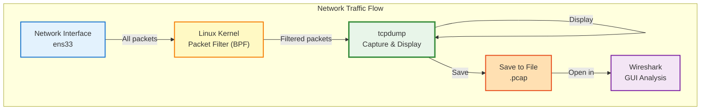
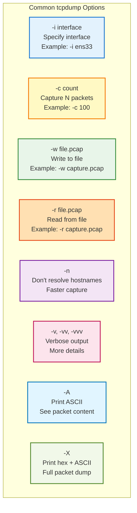
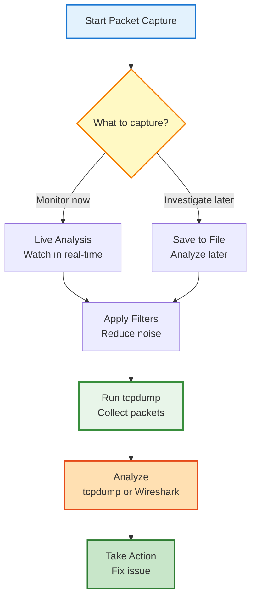

---
tags:
  - networking
  - commands
  - tcpdump
  - packet-capture
  - troubleshooting
  - analysis
  - wireshark
---

# tcpdump - Packet Capture & Analysis Guide

Complete guide to capturing and analyzing network packets using tcpdump in Linux.

---

## What is tcpdump?

**tcpdump** is a command-line packet analyzer that captures and displays network traffic in real-time.



**Think of it as:** A surveillance camera for your network - records everything that passes through.

---

## Installation

### RHEL/CentOS/Fedora
```bash
sudo dnf install tcpdump
```

### Ubuntu/Debian
```bash
sudo apt install tcpdump
```

### Verify Installation
```bash
tcpdump --version
```

**Expected Output:**
```
tcpdump version 4.99.0
libpcap version 1.10.0
```

---

## Basic Usage

### View All Traffic

**Capture all packets on default interface:**
```bash
sudo tcpdump
```

**Output:**
```
10:30:15.123456 IP 192.168.1.100.54321 > 8.8.8.8.53: Flags [S], seq 123456, win 65535
10:30:15.123789 IP 8.8.8.8.53 > 192.168.1.100.54321: Flags [S.], seq 789012, ack 123457
```

**Output breakdown:**
```
10:30:15.123456    - Timestamp
IP                 - Protocol (IP, ARP, etc.)
192.168.1.100      - Source IP
.54321             - Source port
>                  - Direction
8.8.8.8            - Destination IP
.53                - Destination port (DNS)
Flags [S]          - TCP flags (SYN)
```

**Stop capturing:** Press `Ctrl+C`

### Capture on Specific Interface

```bash
# List interfaces first
ip link show

# Capture on ens33
sudo tcpdump -i ens33

# Capture on all interfaces
sudo tcpdump -i any
```

### Limit Number of Packets

```bash
# Capture only 10 packets
sudo tcpdump -c 10

# Capture 100 packets
sudo tcpdump -c 100 -i ens33
```

---

## Essential tcpdump Options



### Common Option Combinations

```bash
# Don't resolve names, be verbose, show hex
sudo tcpdump -i ens33 -nn -vv -X

# Capture to file with timestamps
sudo tcpdump -i ens33 -w capture.pcap -tttt

# Read from file without name resolution
sudo tcpdump -r capture.pcap -nn

# Capture with absolute time and packet content
sudo tcpdump -i ens33 -tttt -A
```

---

## Filtering Traffic

### By Protocol

**Capture specific protocol:**
```bash
# TCP only
sudo tcpdump -i ens33 tcp

# UDP only
sudo tcpdump -i ens33 udp

# ICMP only (ping)
sudo tcpdump -i ens33 icmp

# ARP only
sudo tcpdump -i ens33 arp

# IPv6
sudo tcpdump -i ens33 ip6
```

### By Host

**Specific IP address:**
```bash
# Traffic to/from specific host
sudo tcpdump -i ens33 host 192.168.1.50

# Traffic FROM this host
sudo tcpdump -i ens33 src host 192.168.1.50

# Traffic TO this host
sudo tcpdump -i ens33 dst host 192.168.1.50

# Exclude a host
sudo tcpdump -i ens33 not host 192.168.1.50
```

### By Port

**Specific port:**
```bash
# HTTP traffic (port 80)
sudo tcpdump -i ens33 port 80

# HTTPS traffic (port 443)
sudo tcpdump -i ens33 port 443

# SSH traffic (port 22)
sudo tcpdump -i ens33 port 22

# DNS traffic (port 53)
sudo tcpdump -i ens33 port 53

# MySQL traffic (port 3306)
sudo tcpdump -i ens33 port 3306
```

**Source or destination port:**
```bash
# Source port
sudo tcpdump -i ens33 src port 80

# Destination port
sudo tcpdump -i ens33 dst port 443

# Port range
sudo tcpdump -i ens33 portrange 8000-9000
```

### By Network

**Entire subnet:**
```bash
# Capture from 192.168.1.0/24 network
sudo tcpdump -i ens33 net 192.168.1.0/24

# Or using mask
sudo tcpdump -i ens33 net 192.168.1.0 mask 255.255.255.0

# Exclude a network
sudo tcpdump -i ens33 not net 192.168.1.0/24
```

---

## Combining Filters

### Using Logical Operators

**AND operator:**
```bash
# HTTP traffic to specific host
sudo tcpdump -i ens33 host 192.168.1.50 and port 80

# TCP traffic from specific host
sudo tcpdump -i ens33 src host 192.168.1.100 and tcp
```

**OR operator:**
```bash
# HTTP or HTTPS traffic
sudo tcpdump -i ens33 port 80 or port 443

# Traffic to/from two hosts
sudo tcpdump -i ens33 host 192.168.1.50 or host 192.168.1.51
```

**NOT operator:**
```bash
# Everything except SSH
sudo tcpdump -i ens33 not port 22

# All traffic except from specific host
sudo tcpdump -i ens33 not src host 192.168.1.100
```

### Complex Filter Examples

```bash
# HTTP/HTTPS traffic to/from specific host
sudo tcpdump -i ens33 'host 192.168.1.50 and (port 80 or port 443)'

# All TCP traffic except SSH
sudo tcpdump -i ens33 'tcp and not port 22'

# DNS queries from specific network
sudo tcpdump -i ens33 'src net 192.168.1.0/24 and dst port 53'

# Monitor web traffic between two hosts
sudo tcpdump -i ens33 '(src host 192.168.1.100 and dst host 192.168.1.200) and (port 80 or port 443)'
```

!!! warning "Quotes in Complex Filters"
    Use single quotes around complex filters to prevent shell interpretation.

---

## Packet Capture Workflow



---

## Saving & Reading Captures

### Save to File

**Basic save:**
```bash
sudo tcpdump -i ens33 -w capture.pcap
```

**Save with size/time rotation:**
```bash
# Rotate after 100MB
sudo tcpdump -i ens33 -w capture.pcap -C 100

# Create new file every hour
sudo tcpdump -i ens33 -w capture.pcap -G 3600 -W 24

# Keep only last 10 files
sudo tcpdump -i ens33 -w capture.pcap -C 50 -W 10
```

**Save with filters:**
```bash
# Save only HTTP traffic
sudo tcpdump -i ens33 -w http-traffic.pcap port 80

# Save traffic to specific host
sudo tcpdump -i ens33 -w server-traffic.pcap host 192.168.1.50
```

### Read from File

**Basic read:**
```bash
tcpdump -r capture.pcap
```

**Read with filters:**
```bash
# Show only HTTP traffic from saved file
tcpdump -r capture.pcap port 80

# Show traffic to specific host
tcpdump -r capture.pcap dst host 192.168.1.50

# Show with details
tcpdump -r capture.pcap -nn -vv
```

**Extract specific packets:**
```bash
# First 100 packets
tcpdump -r capture.pcap -c 100

# Packets matching filter
tcpdump -r capture.pcap 'tcp and port 443' -w https-only.pcap
```

---

## Packet Content Display

### ASCII Output

**View packet content in ASCII:**
```bash
sudo tcpdump -i ens33 -A
```

**Example output:**
```
10:30:15.123456 IP 192.168.1.100.54321 > 192.168.1.200.80: Flags [P.], length 78
E..n..@.@.............P.....P.......
GET /index.html HTTP/1.1
Host: example.com
User-Agent: curl/7.68.0
```

**Good for:**
- HTTP requests
- Plain text protocols
- Quick content inspection

### Hex + ASCII Output

**View hex and ASCII:**
```bash
sudo tcpdump -i ens33 -X
```

**Example output:**
```
10:30:15.123456 IP 192.168.1.100.54321 > 192.168.1.200.80: Flags [P.], length 78
    0x0000:  4500 004e 1234 4000 4006 abcd c0a8 0164  E..N.4@.@......d
    0x0010:  c0a8 01c8 d431 0050 1234 5678 9abc def0  .....1.P.4Vx....
    0x0020:  5018 2000 1234 0000 4745 5420 2f69 6e64  P....4..GET./ind
    0x0030:  6578 2e68 746d 6c20 4854 5450 2f31 2e31  ex.html.HTTP/1.1
```

**Good for:**
- Detailed packet analysis
- Binary protocols
- Finding hex patterns

### Hex Only Output

```bash
sudo tcpdump -i ens33 -xx
```

---

## Real-World Capture Examples

### Example 1: Troubleshoot HTTP Connection

**Scenario:** Website not loading

**Capture HTTP traffic:**
```bash
sudo tcpdump -i ens33 -nn -A 'host example.com and port 80'
```

**What to look for:**
- HTTP GET request sent?
- HTTP response received?
- Response code (200 OK, 404 Not Found, etc.)
- Connection established?

### Example 2: Monitor Database Queries

**Capture MySQL traffic:**
```bash
sudo tcpdump -i ens33 -nn -A 'port 3306 and host db-server'
```

**What to see:**
- Queries being sent
- Connection attempts
- Authentication issues
- Response times

### Example 3: Debug DNS Issues

**Capture DNS queries:**
```bash
sudo tcpdump -i ens33 -nn 'port 53'
```

**Better with verbosity:**
```bash
sudo tcpdump -i ens33 -nn -vv 'port 53'
```

**Example output:**
```
10:30:15.123456 IP 192.168.1.100.54321 > 8.8.8.8.53: 12345+ A? google.com. (28)
10:30:15.134567 IP 8.8.8.8.53 > 192.168.1.100.54321: 12345 1/0/0 A 142.250.80.46 (44)
```

**Breakdown:**
- `A?` = Query for A record (IPv4)
- `google.com.` = Domain queried
- `1/0/0` = 1 answer, 0 authority, 0 additional
- `A 142.250.80.46` = Answer received

### Example 4: Capture Three-Way Handshake

**Watch TCP connection establishment:**
```bash
sudo tcpdump -i ens33 -nn 'tcp[tcpflags] & (tcp-syn|tcp-ack) != 0'
```

**Example output:**
```
10:30:15.001 IP 192.168.1.100.54321 > 192.168.1.200.80: Flags [S]    # SYN
10:30:15.002 IP 192.168.1.200.80 > 192.168.1.100.54321: Flags [S.]   # SYN-ACK
10:30:15.003 IP 192.168.1.100.54321 > 192.168.1.200.80: Flags [.]    # ACK
```

### Example 5: Detect Port Scan

**Capture SYN packets (potential scan):**
```bash
sudo tcpdump -i ens33 -nn 'tcp[tcpflags] == tcp-syn'
```

**If you see many SYN packets to different ports from same IP:**
```
10:30:15.001 IP 10.0.0.50.12345 > 192.168.1.100.22: Flags [S]
10:30:15.002 IP 10.0.0.50.12346 > 192.168.1.100.23: Flags [S]
10:30:15.003 IP 10.0.0.50.12347 > 192.168.1.100.80: Flags [S]
10:30:15.004 IP 10.0.0.50.12348 > 192.168.1.100.443: Flags [S]
```
**Potential port scan from 10.0.0.50!**

---

## Advanced Filters

### TCP Flags

**Capture specific TCP flags:**
```bash
# SYN packets (connection attempts)
sudo tcpdump -i ens33 'tcp[tcpflags] & tcp-syn != 0'

# SYN+ACK packets (connection acknowledgment)
sudo tcpdump -i ens33 'tcp[tcpflags] & (tcp-syn|tcp-ack) == (tcp-syn|tcp-ack)'

# RST packets (connection reset)
sudo tcpdump -i ens33 'tcp[tcpflags] & tcp-rst != 0'

# FIN packets (connection close)
sudo tcpdump -i ens33 'tcp[tcpflags] & tcp-fin != 0'

# PSH packets (data push)
sudo tcpdump -i ens33 'tcp[tcpflags] & tcp-push != 0'
```

### Packet Size Filters

```bash
# Packets larger than 1000 bytes
sudo tcpdump -i ens33 'greater 1000'

# Packets smaller than 100 bytes
sudo tcpdump -i ens33 'less 100'

# Specific size
sudo tcpdump -i ens33 'len == 64'
```

### ICMP Type Filters

```bash
# Echo request (ping)
sudo tcpdump -i ens33 'icmp[icmptype] == icmp-echo'

# Echo reply (ping response)
sudo tcpdump -i ens33 'icmp[icmptype] == icmp-echoreply'

# Destination unreachable
sudo tcpdump -i ens33 'icmp[icmptype] == icmp-unreach'
```

### Broadcast/Multicast

```bash
# Broadcast packets
sudo tcpdump -i ens33 'ether broadcast'

# Multicast packets
sudo tcpdump -i ens33 'ether multicast'

# No broadcast/multicast
sudo tcpdump -i ens33 'not ether broadcast and not ether multicast'
```

---

## Analyzing Captures with Wireshark

### Save for Wireshark

**Capture to pcap:**
```bash
sudo tcpdump -i ens33 -w capture.pcap -c 1000
```

**Transfer to your desktop:**
```bash
# Using scp
scp user@server:/path/to/capture.pcap .

# Using rsync
rsync -avz user@server:/path/to/capture.pcap .
```

**Open in Wireshark:**
```bash
wireshark capture.pcap
```

### Remote Capture to Wireshark

**Stream directly to Wireshark:**
```bash
# On remote server
ssh user@server 'sudo tcpdump -i ens33 -U -s0 -w - not port 22' | wireshark -k -i -
```

**What this does:**
- SSH to server
- Run tcpdump (exclude SSH traffic)
- Stream output to local Wireshark
- `-k` = start capturing immediately
- `-i -` = read from stdin

---

## Performance Tips

### Reduce CPU Usage

**Buffer snaplen (snapshot length):**
```bash
# Capture only first 96 bytes (headers only)
sudo tcpdump -i ens33 -s 96

# Full packets (default 262144)
sudo tcpdump -i ens33 -s 0
```

**Skip DNS resolution:**
```bash
# Much faster
sudo tcpdump -i ens33 -nn
```

**Use specific filters:**
```bash
# Filter early to reduce processing
sudo tcpdump -i ens33 'port 80 or port 443'
```

### Capture High-Speed Traffic

**Buffer size:**
```bash
# Increase buffer to 10MB (reduce packet loss)
sudo tcpdump -i ens33 -B 10240
```

**Ring buffer mode:**
```bash
# Rotate 5 files of 100MB each
sudo tcpdump -i ens33 -w capture.pcap -C 100 -W 5
```

---

## Troubleshooting Scenarios

### Scenario 1: Slow Website

**Capture:**
```bash
sudo tcpdump -i ens33 -nn -tttt 'host website.com and (port 80 or port 443)' -w slow-site.pcap
```

**Analyze:**
```bash
tcpdump -r slow-site.pcap -nn -tttt
```

**Look for:**
- High time between request and response
- Retransmissions
- Small window sizes
- TCP ZeroWindow packets

### Scenario 2: Connection Timeouts

**Capture:**
```bash
sudo tcpdump -i ens33 -nn 'host server-ip and port 3306'
```

**Look for:**
- SYN packets without SYN-ACK response
- RST packets (connection reset)
- ICMP unreachable messages

### Scenario 3: Packet Loss

**Capture with sequence numbers:**
```bash
sudo tcpdump -i ens33 -nn -vv 'host target-server'
```

**Look for:**
- Duplicate ACKs
- Out-of-order packets
- Retransmissions
- Gaps in sequence numbers

### Scenario 4: Security Investigation

**Capture suspicious traffic:**
```bash
# Monitor for unauthorized access attempts
sudo tcpdump -i ens33 -nn -w security.pcap 'tcp[tcpflags] == tcp-syn and not src net 192.168.1.0/24'
```

**Look for:**
- External IPs scanning ports
- Unusual protocols
- Large data transfers
- Connections to unknown IPs

---

## tcpdump Cheat Sheet

### Quick Reference

```bash
# Basic capture
sudo tcpdump -i ens33

# Save to file
sudo tcpdump -i ens33 -w file.pcap

# Read from file
tcpdump -r file.pcap

# Specific host
sudo tcpdump -i ens33 host 192.168.1.100

# Specific port
sudo tcpdump -i ens33 port 80

# HTTP/HTTPS traffic
sudo tcpdump -i ens33 'port 80 or port 443'

# Exclude SSH (when connected via SSH)
sudo tcpdump -i ens33 'not port 22'

# DNS queries
sudo tcpdump -i ens33 -nn 'port 53'

# See packet content
sudo tcpdump -i ens33 -A 'port 80'

# First 100 packets
sudo tcpdump -i ens33 -c 100

# Between two hosts
sudo tcpdump -i ens33 'host 192.168.1.100 and host 192.168.1.200'

# Capture to rotating files
sudo tcpdump -i ens33 -w capture.pcap -C 100 -W 5
```

### Common Filters

| What | Filter |
|------|--------|
| HTTP | `port 80` |
| HTTPS | `port 443` |
| SSH | `port 22` |
| DNS | `port 53` |
| SMTP | `port 25` |
| MySQL | `port 3306` |
| PostgreSQL | `port 5432` |
| Ping | `icmp` |
| TCP | `tcp` |
| UDP | `udp` |
| From host | `src host IP` |
| To host | `dst host IP` |
| Network | `net 192.168.1.0/24` |
| Port range | `portrange 8000-9000` |

---

## Integration with Other Tools

### With grep

**Filter output:**
```bash
sudo tcpdump -i ens33 -A | grep -i "GET\|POST"
```

### With tshark

**More powerful than tcpdump:**
```bash
# Install
sudo dnf install wireshark-cli

# Use tshark
sudo tshark -i ens33 -f "port 80"
```

### With awk

**Extract specific fields:**
```bash
sudo tcpdump -i ens33 -nn | awk '{print $3, $5}'
```

### Create Statistics

```bash
# Count packets per source IP
sudo tcpdump -i ens33 -nn -c 1000 | awk '{print $3}' | cut -d. -f1-4 | sort | uniq -c | sort -rn
```

---

## Automation Scripts

### Capture Script with Rotation

```bash
#!/bin/bash
# auto-capture.sh - Automated packet capture with rotation

INTERFACE="ens33"
CAPTURE_DIR="/var/captures"
FILE_SIZE="100"  # MB
FILE_COUNT="10"
FILTER="not port 22"

sudo mkdir -p $CAPTURE_DIR

echo "Starting packet capture on $INTERFACE"
echo "Saving to: $CAPTURE_DIR"
echo "Filter: $FILTER"

sudo tcpdump -i $INTERFACE \
  -w $CAPTURE_DIR/capture-$(date +%Y%m%d-%H%M%S).pcap \
  -C $FILE_SIZE \
  -W $FILE_COUNT \
  -Z root \
  "$FILTER"
```

### Monitor Specific Service

```bash
#!/bin/bash
# monitor-service.sh - Monitor web server traffic

SERVICE_IP="192.168.1.100"
DURATION="60"  # seconds

echo "Monitoring traffic to $SERVICE_IP for $DURATION seconds..."

timeout $DURATION sudo tcpdump -i ens33 -nn -c 1000 \
  "host $SERVICE_IP and (port 80 or port 443)" | \
  tee service-monitor.log

echo "Capture complete. Analyzing..."
echo "Total packets: $(wc -l < service-monitor.log)"
echo "Unique IPs: $(grep -oP '\d+\.\d+\.\d+\.\d+' service-monitor.log | sort -u | wc -l)"
```

---

## Best Practices

### Security

!!! warning "Root Required"
    tcpdump requires root/sudo to capture packets.

!!! danger "Privacy Considerations"
    Packet captures may contain sensitive data. Handle with care.

### Performance

1. **Use filters** - Capture only what you need
2. **Limit snapshot length** - Use `-s 96` for headers only
3. **Don't resolve names** - Use `-nn` for speed
4. **Rotate files** - Prevent huge files

### Analysis

1. **Save to file first** - Analyze offline
2. **Use Wireshark** - For complex analysis
3. **Be specific** - Good filters = useful data
4. **Document** - Note what you're capturing and why

---

## Troubleshooting tcpdump

### Problem: Permission Denied

**Error:**
```
tcpdump: ens33: You don't have permission to capture on that device
```

**Fix:**
```bash
# Use sudo
sudo tcpdump -i ens33

# Or add user to wireshark group (one-time)
sudo usermod -a -G wireshark $USER
# Log out and back in
```

### Problem: Interface Not Found

**Error:**
```
tcpdump: ens33: No such device exists
```

**Fix:**
```bash
# List interfaces
ip link show
tcpdump -D

# Use correct interface name
sudo tcpdump -i ens32  # or whatever is correct
```

### Problem: No Packets Captured

**Check:**
```bash
# Is interface up?
ip link show ens33

# Is there actually traffic?
ping 8.8.8.8  # in another terminal

# Are you filtering too much?
sudo tcpdump -i ens33 -c 10  # Capture anything
```

---

## See Also

- [Network Troubleshooting](../troubleshooting/connectivity.md)
- [Network Performance](../troubleshooting/performance.md)
- [OSI Model](../basics/osi-model.md)
- [nmcli Commands](nmcli.md)

---

**Last Updated:** 2024-02-09  
**Difficulty:** Intermediate  
**Estimated Time:** 30 minutes