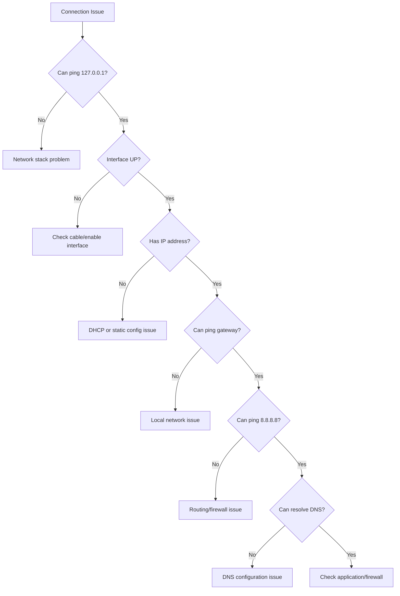

---
tags:
  - troubleshooting
  - connectivity
  - networking
  - diagnostics
---

# Network Connectivity Troubleshooting

Step-by-step guide to diagnosing and fixing network connectivity issues in RHEL.

---

## Quick Diagnosis Flowchart



---

## Problem: No Network Connectivity

### Symptom
- Cannot ping anything
- No internet access
- Network icon shows disconnected

### Diagnosis Steps

#### Step 1: Check Physical Layer

```bash
# Check if interface is UP
ip link show ens33
```

**Good Output:**
```
2: ens33: <BROADCAST,MULTICAST,UP,LOWER_UP> mtu 1500
```

**Bad Output:**
```
2: ens33: <BROADCAST,MULTICAST> mtu 1500
```

!!! tip "What to look for"
    - `UP` must be present
    - `LOWER_UP` means cable is connected
    - Missing `LOWER_UP` = cable problem

**Fix if DOWN:**
```bash
sudo ip link set ens33 up
```

---

#### Step 2: Check IP Address

```bash
# View IP configuration
ip addr show ens33
```

**Good Output:**
```
2: ens33: <BROADCAST,MULTICAST,UP,LOWER_UP>
    inet 192.168.1.100/24 brd 192.168.1.255 scope global ens33
```

**Bad Output (No IP):**
```
2: ens33: <BROADCAST,MULTICAST,UP,LOWER_UP>
    (no inet line)
```

**Fix for DHCP:**
```bash
# Request IP from DHCP
sudo dhclient -v ens33

# Or restart NetworkManager
sudo systemctl restart NetworkManager
```

**Fix for Static IP:**
```bash
# Configure static IP
sudo nmcli connection modify ens33 \
  ipv4.method manual \
  ipv4.addresses "192.168.1.100/24" \
  ipv4.gateway "192.168.1.1"

sudo nmcli connection up ens33
```

---

#### Step 3: Check Default Gateway

```bash
# View routing table
ip route show
```

**Good Output:**
```
default via 192.168.1.1 dev ens33 proto static metric 100
192.168.1.0/24 dev ens33 proto kernel scope link src 192.168.1.100
```

**Bad Output (No Default Route):**
```
192.168.1.0/24 dev ens33 proto kernel scope link src 192.168.1.100
```

**Fix:**
```bash
sudo nmcli connection modify ens33 ipv4.gateway "192.168.1.1"
sudo nmcli connection up ens33
```

---

#### Step 4: Test Gateway Connectivity

```bash
# Ping gateway
ping -c 4 192.168.1.1
```

**Good Output:**
```
64 bytes from 192.168.1.1: icmp_seq=1 ttl=64 time=0.5 ms
64 bytes from 192.168.1.1: icmp_seq=2 ttl=64 time=0.4 ms
4 packets transmitted, 4 received, 0% packet loss
```

**Bad Output:**
```
From 192.168.1.100 icmp_seq=1 Destination Host Unreachable
4 packets transmitted, 0 received, 100% packet loss
```

**Troubleshooting no gateway response:**

1. **Check if on same subnet:**
   ```bash
   # Your IP: 192.168.1.100/24
   # Gateway must be: 192.168.1.x
   ```

2. **Check ARP table:**
   ```bash
   ip neigh show
   ```
   
   Should show gateway MAC address:
   ```
   192.168.1.1 dev ens33 lladdr aa:bb:cc:dd:ee:ff REACHABLE
   ```

3. **Check firewall:**
   ```bash
   sudo firewall-cmd --list-all
   ```

---

#### Step 5: Test External Connectivity

```bash
# Ping external IP (Google DNS)
ping -c 4 8.8.8.8
```

**If this works but DNS doesn't:**
→ Skip to [DNS Troubleshooting](#problem-dns-not-working)

**If this fails:**
→ Routing or firewall issue

---

### Common Fixes

#### Fix 1: Restart Network Services

```bash
# Restart NetworkManager
sudo systemctl restart NetworkManager

# Check status
sudo systemctl status NetworkManager
```

#### Fix 2: Reload Connection

```bash
# Reload all connections
sudo nmcli connection reload

# Restart specific connection
sudo nmcli connection down ens33
sudo nmcli connection up ens33
```

#### Fix 3: Check NetworkManager Logs

```bash
# View recent logs
sudo journalctl -u NetworkManager -n 50

# Follow logs in real-time
sudo journalctl -u NetworkManager -f
```

#### Fix 4: Verify Interface Configuration

```bash
# Check connection details
nmcli connection show ens33

# Look for:
# - ipv4.method (should be 'manual' or 'auto')
# - ipv4.addresses (your IP)
# - ipv4.gateway (your gateway)
```

---

## Problem: DNS Not Working

### Symptom
- Can ping 8.8.8.8 but not google.com
- "Name or service not known" errors
- `dig` fails to resolve

### Diagnosis

#### Test DNS Resolution

```bash
# Test with dig
dig google.com

# Test with nslookup
nslookup google.com

# Test with host
host google.com
```

**Good Output (dig):**
```
;; ANSWER SECTION:
google.com.             300     IN      A       142.250.80.46
```

**Bad Output:**
```
;; connection timed out; no servers could be reached
```

---

### Check DNS Configuration

```bash
# View current DNS servers
cat /etc/resolv.conf
```

**Good Output:**
```
nameserver 8.8.8.8
nameserver 8.8.4.4
```

**Bad Output:**
```
# Empty or no nameserver entries
```

---

### Fixes

#### Fix 1: Set DNS Servers

```bash
sudo nmcli connection modify ens33 \
  ipv4.dns "8.8.8.8 8.8.4.4"

sudo nmcli connection up ens33
```

**Verify:**
```bash
cat /etc/resolv.conf
dig google.com
```

---

#### Fix 2: Test Specific DNS Server

```bash
# Test Google DNS
dig @8.8.8.8 google.com

# Test Cloudflare DNS
dig @1.1.1.1 google.com

# Test your router (if it's a DNS server)
dig @192.168.1.1 google.com
```

**If external DNS works but configured one doesn't:**
→ Your DNS server is down or unreachable

---

#### Fix 3: Flush DNS Cache

```bash
# Restart systemd-resolved (if using)
sudo systemctl restart systemd-resolved

# Or restart NetworkManager
sudo systemctl restart NetworkManager
```

---

#### Fix 4: Check DNS Search Domain

```bash
# View search domains
cat /etc/resolv.conf | grep search
```

**Set search domain:**
```bash
sudo nmcli connection modify ens33 \
  ipv4.dns-search "example.com"
```

---

## Problem: Intermittent Connection Drops

### Symptom
- Connection randomly disconnects
- Ping shows packet loss
- SSH sessions timeout

### Diagnosis

#### Monitor Connection

```bash
# Continuous ping with timestamp
ping 192.168.1.1 | while read line; do echo "$(date): $line"; done
```

**Look for:**
```
Sun Feb  8 10:15:23 IST 2024: 64 bytes from 192.168.1.1: icmp_seq=1 time=0.5 ms
Sun Feb  8 10:15:24 IST 2024: 64 bytes from 192.168.1.1: icmp_seq=2 time=0.4 ms
Sun Feb  8 10:15:29 IST 2024: 64 bytes from 192.168.1.1: icmp_seq=7 time=5.2 ms (gap indicates drop)
```

---

#### Check Interface Errors

```bash
# View error statistics
ip -s link show ens33
```

**Look for:**
```
RX: bytes  packets  errors  dropped  overrun  mcast
    1234567  8901    0       0        0        234
TX: bytes  packets  errors  dropped  carrier  collsns
    2345678  9012    0       0        0        0
```

**Non-zero errors/dropped = problem**

---

#### Check System Logs

```bash
# Look for network errors
sudo dmesg | grep -i ens33
sudo dmesg | grep -i network

# Check for hardware issues
sudo journalctl -k | grep -i ens33
```

**Common issues to look for:**
- Link up/down messages
- Firmware errors
- Hardware failures

---

### Fixes

#### Fix 1: Check Cable/Port

1. Try different network cable
2. Try different switch port
3. Check for physical damage

#### Fix 2: Disable Power Management

```bash
# Check if power management is enabled
ethtool ens33 | grep "Wake-on"

# Disable power saving
sudo ethtool -s ens33 wol d

# Make persistent (add to connection)
sudo nmcli connection modify ens33 \
  802-3-ethernet.wake-on-lan ignore
```

#### Fix 3: Adjust MTU

```bash
# Check current MTU
ip link show ens33

# Set MTU (if needed)
sudo nmcli connection modify ens33 802-3-ethernet.mtu 1500
sudo nmcli connection up ens33
```

---

## Problem: Slow Network Performance

### Symptom
- High latency
- Slow downloads
- Timeouts

### Diagnosis

#### Test Latency

```bash
# Ping with statistics
ping -c 100 192.168.1.1 | tail -n 3
```

**Good Output:**
```
rtt min/avg/max/mdev = 0.234/0.456/1.234/0.123 ms
```

**Bad Output (high latency):**
```
rtt min/avg/max/mdev = 50.234/100.456/200.234/50.123 ms
```

---

#### Test Bandwidth

```bash
# Install iperf3
sudo dnf install -y iperf3

# On server machine
iperf3 -s

# On client machine
iperf3 -c server_ip
```

**Expected output:**
```
[  5]   0.00-10.00  sec   1.09 GBytes   940 Mbits/sec
```

---

#### Check Network Utilization

```bash
# Install iftop
sudo dnf install -y iftop

# Monitor bandwidth
sudo iftop -i ens33
```

---

### Fixes

#### Fix 1: Check for Duplex Mismatch

```bash
# View current settings
ethtool ens33 | grep -i duplex
ethtool ens33 | grep -i speed

# Should show:
# Speed: 1000Mb/s
# Duplex: Full
```

**If showing half-duplex, force full:**
```bash
sudo ethtool -s ens33 speed 1000 duplex full autoneg off
```

#### Fix 2: Disable Offloading Features (if problematic)

```bash
# Check current offload settings
ethtool -k ens33

# Disable if causing issues
sudo ethtool -K ens33 gro off
sudo ethtool -K ens33 tso off
```

#### Fix 3: Check for Network Congestion

```bash
# Monitor packet drops
watch -n 1 'ip -s link show ens33'

# Check switch/router for congestion
```

---

## Problem: Cannot Connect to Specific Service

### Symptom
- Can ping server but service not responding
- Connection refused or timeout

### Diagnosis

#### Test Port Connectivity

```bash
# Using telnet
telnet server_ip 80

# Using nc (netcat)
nc -zv server_ip 80

# Using nmap
nmap -p 80 server_ip
```

**Good Output (nc):**
```
Connection to server_ip 80 port [tcp/http] succeeded!
```

**Bad Output:**
```
nc: connect to server_ip port 80 (tcp) failed: Connection refused
```

---

#### Check Firewall Rules

**On client:**
```bash
# Check if outbound is blocked
sudo firewall-cmd --list-all
```

**On server:**
```bash
# Check if port is allowed
sudo firewall-cmd --list-all | grep -i 80

# Allow if needed
sudo firewall-cmd --permanent --add-service=http
sudo firewall-cmd --reload
```

---

#### Check Service Status

**On server:**
```bash
# Check if service is running
sudo systemctl status httpd

# Check if listening on port
sudo ss -tuln | grep :80
sudo netstat -tuln | grep :80
```

---

## Essential Troubleshooting Commands

### Quick Reference

```bash
# Interface status
ip link show

# IP configuration
ip addr show

# Routing
ip route show

# Test connectivity
ping -c 4 <target>

# DNS test
dig google.com
nslookup google.com

# Port test
nc -zv <host> <port>

# View connections
ss -tuln
netstat -tuln

# Interface statistics
ip -s link show

# Firewall status
sudo firewall-cmd --state

# Service logs
sudo journalctl -u NetworkManager -n 50
```

---

## Troubleshooting Workflow

```bash
#!/bin/bash
# Network diagnostic script

echo "=== Network Diagnostics ==="
echo

echo "1. Interface Status:"
ip link show | grep -A 1 "^2:"
echo

echo "2. IP Address:"
ip addr show | grep "inet "
echo

echo "3. Default Route:"
ip route | grep default
echo

echo "4. DNS Servers:"
cat /etc/resolv.conf | grep nameserver
echo

echo "5. Test Gateway:"
gateway=$(ip route | grep default | awk '{print $3}')
ping -c 2 $gateway 2>&1 | tail -n 2
echo

echo "6. Test External:"
ping -c 2 8.8.8.8 2>&1 | tail -n 2
echo

echo "7. Test DNS:"
dig +short google.com
echo

echo "8. NetworkManager Status:"
systemctl is-active NetworkManager
```

**Save and run:**
```bash
chmod +x network-diag.sh
./network-diag.sh
```

---

## See Also

- [nmcli Command Reference](../commands/nmcli.md)
- [IP Command Reference](../commands/ip-command.md)
- [Firewall Configuration](../../rhel/configuration/firewall.md)

---

**Last Updated:** 2024-02-08  
**Tested On:** RHEL 8.x, RHEL 9.x
