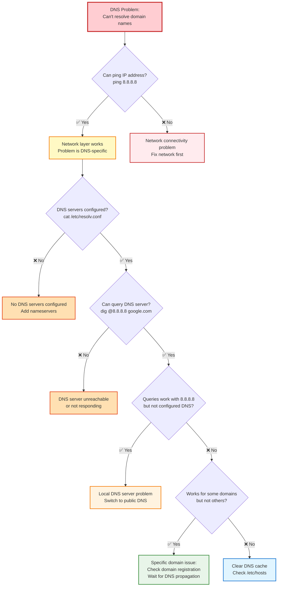
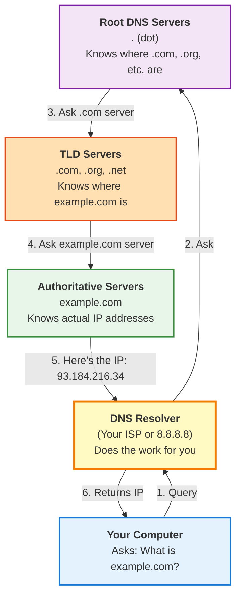

---
tags:
  - troubleshooting
  - dns
  - networking
  - name-resolution
  - diagnostics
  - rhel
---

# DNS Troubleshooting Guide

Complete guide to diagnosing and fixing DNS (Domain Name System) issues in Linux.

---

## Quick Diagnosis



---

## Understanding DNS

### What is DNS?

**DNS (Domain Name System)** translates human-readable domain names into IP addresses.

```
You type:     google.com
DNS resolves: 142.250.80.46
Your browser connects to the IP address
```

### DNS Hierarchy



---

## Symptom 1: Can't Resolve Any Domain Names

### Symptoms
- ✅ Can ping IP addresses: `ping 8.8.8.8` works
- ❌ Can't ping domain names: `ping google.com` fails
- Error: "Name or service not known"

### Diagnosis Steps

#### Step 1: Check DNS Configuration

**View current DNS servers:**
```bash
cat /etc/resolv.conf
```

**Good Output:**
```
nameserver 8.8.8.8
nameserver 8.8.4.4
search example.com
```

**Bad Output (Empty or missing):**
```
# Empty file or no nameserver lines
```

#### Step 2: Test DNS Resolution

**Using dig:**
```bash
dig google.com
```

**Good Output:**
```
;; ANSWER SECTION:
google.com.             300     IN      A       142.250.80.46

;; Query time: 23 msec
;; SERVER: 8.8.8.8#53(8.8.8.8)
```

**Bad Output:**
```
;; connection timed out; no servers could be reached
```

**Using nslookup:**
```bash
nslookup google.com
```

**Good Output:**
```
Server:         8.8.8.8
Address:        8.8.8.8#53

Name:   google.com
Address: 142.250.80.46
```

#### Step 3: Test Specific DNS Server

**Test Google DNS directly:**
```bash
dig @8.8.8.8 google.com
```

**Test your configured DNS:**
```bash
# Get your DNS server
dns_server=$(grep nameserver /etc/resolv.conf | head -1 | awk '{print $2}')

# Test it
dig @$dns_server google.com
```

### Fixes

#### Fix 1: Add DNS Servers (Temporary)

**Edit resolv.conf directly (temporary until reboot):**
```bash
sudo bash -c 'cat > /etc/resolv.conf << EOF
nameserver 8.8.8.8
nameserver 8.8.4.4
nameserver 1.1.1.1
EOF'
```

**Verify:**
```bash
cat /etc/resolv.conf
ping -c 2 google.com
```

#### Fix 2: Configure DNS Permanently (NetworkManager)

**Using nmcli:**
```bash
# Set DNS servers
sudo nmcli connection modify ens33 \
  ipv4.dns "8.8.8.8 8.8.4.4"

# Apply changes
sudo nmcli connection up ens33
```

**Verify:**
```bash
cat /etc/resolv.conf
dig google.com
```

#### Fix 3: Configure DNS Permanently (systemd-resolved)

**If using systemd-resolved:**
```bash
# Edit resolved configuration
sudo vi /etc/systemd/resolved.conf

# Add:
[Resolve]
DNS=8.8.8.8 8.8.4.4
FallbackDNS=1.1.1.1 1.0.0.1

# Restart service
sudo systemctl restart systemd-resolved

# Verify
resolvectl status
```

---

## Symptom 2: Slow DNS Resolution

### Symptoms
- DNS queries take 5-10+ seconds
- Websites load slowly initially
- `dig` shows high query times

### Diagnosis

**Measure DNS query time:**
```bash
# Single query
dig google.com | grep "Query time"
```

**Good Output:**
```
;; Query time: 23 msec
```

**Bad Output:**
```
;; Query time: 5247 msec  # Over 5 seconds!
```

**Test multiple DNS servers:**
```bash
# Google DNS
time dig @8.8.8.8 google.com +short

# Cloudflare DNS
time dig @1.1.1.1 google.com +short

# Your ISP DNS
time dig @$(grep nameserver /etc/resolv.conf | head -1 | awk '{print $2}') google.com +short
```

### Fixes

#### Fix 1: Switch to Faster DNS Servers

**Popular public DNS servers:**

| Provider | Primary | Secondary | Features |
|----------|---------|-----------|----------|
| Google | 8.8.8.8 | 8.8.4.4 | Fast, reliable |
| Cloudflare | 1.1.1.1 | 1.0.0.1 | Privacy-focused, very fast |
| Quad9 | 9.9.9.9 | 149.112.112.112 | Security filtering |
| OpenDNS | 208.67.222.222 | 208.67.220.220 | Filtering options |

**Configure Cloudflare DNS:**
```bash
sudo nmcli connection modify ens33 \
  ipv4.dns "1.1.1.1 1.0.0.1"

sudo nmcli connection up ens33
```

**Test the change:**
```bash
dig google.com | grep "Query time"
```

#### Fix 2: Enable DNS Caching

**Install and configure dnsmasq:**
```bash
# Install
sudo dnf install dnsmasq

# Configure
sudo bash -c 'cat > /etc/dnsmasq.conf << EOF
# Listen on localhost only
listen-address=127.0.0.1

# Use these upstream DNS servers
server=8.8.8.8
server=1.1.1.1

# Cache size
cache-size=1000
EOF'

# Start service
sudo systemctl start dnsmasq
sudo systemctl enable dnsmasq

# Configure NetworkManager to use local cache
sudo nmcli connection modify ens33 ipv4.dns "127.0.0.1"
sudo nmcli connection up ens33
```

**Verify caching:**
```bash
# First query (will be slow)
time dig google.com +short

# Second query (should be instant from cache)
time dig google.com +short
```

#### Fix 3: Optimize systemd-resolved

**Configure systemd-resolved for better performance:**
```bash
sudo vi /etc/systemd/resolved.conf

# Add:
[Resolve]
DNS=1.1.1.1 8.8.8.8
FallbackDNS=1.0.0.1 8.8.4.4
Cache=yes
DNSStubListener=yes

# Restart
sudo systemctl restart systemd-resolved
```

---

## Symptom 3: Some Domains Don't Resolve

### Symptoms
- Can resolve google.com, facebook.com
- Can't resolve internal.company.com or specific domains
- Error: "NXDOMAIN" or "Non-existent domain"

### Diagnosis

**Test the specific domain:**
```bash
dig internal.company.com
```

**Output shows:**
```
;; ->>HEADER<<- opcode: QUERY, status: NXDOMAIN
```

**Try different DNS servers:**
```bash
# Try with Google DNS
dig @8.8.8.8 internal.company.com

# Try with your ISP DNS
dig @192.168.1.1 internal.company.com
```

### Common Causes & Fixes

#### Cause 1: Internal/Private Domain

**Issue:** Using public DNS for internal domain names

**Fix: Use company DNS server for internal domains**

**Split DNS configuration:**
```bash
# Install dnsmasq for split DNS
sudo dnf install dnsmasq

# Configure
sudo bash -c 'cat > /etc/dnsmasq.conf << EOF
# Send .company.com queries to internal DNS
server=/company.com/192.168.1.10

# Send everything else to public DNS
server=8.8.8.8
server=1.1.1.1
EOF'

# Restart
sudo systemctl restart dnsmasq

# Point to local dnsmasq
sudo nmcli connection modify ens33 ipv4.dns "127.0.0.1"
sudo nmcli connection up ens33
```

#### Cause 2: DNS Search Domain Not Set

**Issue:** Can't resolve short names like "server1" (need server1.company.com)

**Fix: Add search domain**
```bash
# Configure search domain
sudo nmcli connection modify ens33 \
  ipv4.dns-search "company.com internal.local"

sudo nmcli connection up ens33
```

**Verify:**
```bash
cat /etc/resolv.conf
# Should show:
# search company.com internal.local

# Now "server1" resolves as "server1.company.com"
ping server1
```

#### Cause 3: Domain Recently Changed/New

**Issue:** DNS propagation delay or domain doesn't exist yet

**Check domain registration:**
```bash
whois example.com

# Check if DNS servers are set
dig example.com NS

# Check authoritative server directly
dig @ns1.example.com example.com
```

**Solution:** Wait for DNS propagation (can take 24-48 hours)

---

## Symptom 4: DNS Works But Browser Doesn't

### Symptoms
- `dig google.com` works
- `ping google.com` works
- Browser shows "DNS_PROBE_FINISHED_NXDOMAIN"

### Diagnosis & Fixes

#### Fix 1: Clear Browser DNS Cache

**Chrome/Chromium:**
```
Navigate to: chrome://net-internals/#dns
Click: "Clear host cache"
```

**Firefox:**
```
Type in address bar: about:networking#dns
Click: "Clear DNS Cache"
```

#### Fix 2: Check Browser Proxy Settings

**Verify no proxy is set:**
```bash
# Check environment variables
echo $http_proxy
echo $https_proxy
echo $no_proxy

# Unset if present
unset http_proxy
unset https_proxy
```

#### Fix 3: Check /etc/hosts

**Verify no conflicts:**
```bash
cat /etc/hosts

# Look for entries that might override DNS
# Example of problematic entry:
# 127.0.0.1  google.com  # This would break google.com!
```

**Remove bad entries:**
```bash
sudo vi /etc/hosts
# Remove or comment out problematic lines
```

---

## Symptom 5: Intermittent DNS Failures

### Symptoms
- DNS works sometimes, fails other times
- Random timeout errors
- Works after retry

### Diagnosis

**Monitor DNS queries:**
```bash
# Watch DNS queries in real-time
sudo tcpdump -i ens33 port 53 -n

# Make some DNS queries in another terminal
dig google.com
dig facebook.com
```

**Check DNS server response time:**
```bash
# Test 10 times
for i in {1..10}; do
  echo -n "Query $i: "
  dig google.com | grep "Query time"
  sleep 1
done
```

### Fixes

#### Fix 1: Add Multiple DNS Servers

**Configure redundant DNS:**
```bash
sudo nmcli connection modify ens33 \
  ipv4.dns "1.1.1.1 8.8.8.8 1.0.0.1 8.8.4.4"

sudo nmcli connection up ens33
```

**Verify:**
```bash
cat /etc/resolv.conf
# Should show multiple nameserver lines
```

#### Fix 2: Increase DNS Timeout

**For systemd-resolved:**
```bash
sudo vi /etc/systemd/resolved.conf

# Add:
[Resolve]
DNSOverTLS=no
DNSSEC=no
# These can cause intermittent failures
```

#### Fix 3: Check Firewall

**Ensure DNS traffic allowed:**
```bash
# Allow DNS (port 53 UDP)
sudo firewall-cmd --add-service=dns --permanent
sudo firewall-cmd --reload

# Verify
sudo firewall-cmd --list-services | grep dns
```

---

## Advanced Troubleshooting

### DNS Cache Issues

**Clear systemd-resolved cache:**
```bash
sudo systemd-resolve --flush-caches
# or
sudo resolvectl flush-caches

# Verify
sudo resolvectl statistics
```

**Clear dnsmasq cache:**
```bash
sudo systemctl restart dnsmasq
```

**Clear browser caches:**
- Chrome: `chrome://net-internals/#dns` → Clear
- Firefox: `about:networking#dns` → Clear

### Check DNS Server is Reachable

**Test UDP port 53:**
```bash
# Using nc (netcat)
nc -zvu 8.8.8.8 53

# Using nmap
nmap -sU -p 53 8.8.8.8
```

**Trace DNS path:**
```bash
# Trace route to DNS server
traceroute 8.8.8.8

# MTR for continuous monitoring
mtr 8.8.8.8
```

### DNSSEC Validation Issues

**Test DNSSEC:**
```bash
dig +dnssec google.com
```

**Disable DNSSEC if causing issues:**
```bash
sudo vi /etc/systemd/resolved.conf

# Set:
[Resolve]
DNSSEC=no

sudo systemctl restart systemd-resolved
```

### IPv6 DNS Issues

**Test IPv6 DNS:**
```bash
dig @2001:4860:4860::8888 google.com AAAA
```

**Disable IPv6 DNS if causing problems:**
```bash
sudo nmcli connection modify ens33 ipv6.method ignore
sudo nmcli connection up ens33
```

---

## DNS Testing Toolkit

### Essential Commands

```bash
# Basic DNS query
dig example.com

# Query specific record type
dig example.com A      # IPv4 address
dig example.com AAAA   # IPv6 address
dig example.com MX     # Mail servers
dig example.com NS     # Name servers
dig example.com TXT    # Text records

# Short output
dig example.com +short

# Trace full DNS resolution
dig example.com +trace

# Query specific DNS server
dig @8.8.8.8 example.com

# Reverse DNS lookup
dig -x 8.8.8.8

# Using nslookup
nslookup example.com
nslookup example.com 8.8.8.8

# Using host
host example.com
host -t MX example.com
```

### DNS Diagnostic Script

```bash
#!/bin/bash
# DNS Diagnostic Script

DOMAIN="${1:-google.com}"

echo "================================"
echo "DNS Diagnostic Report"
echo "Domain: $DOMAIN"
echo "================================"
echo

echo "1. Current DNS Configuration:"
echo "----------------------------"
cat /etc/resolv.conf
echo

echo "2. Can ping IP addresses?"
echo "----------------------------"
ping -c 2 8.8.8.8
echo

echo "3. DNS Query Test:"
echo "----------------------------"
dig $DOMAIN +short
echo

echo "4. Query Time:"
echo "----------------------------"
dig $DOMAIN | grep "Query time"
echo

echo "5. Test with Google DNS:"
echo "----------------------------"
dig @8.8.8.8 $DOMAIN +short
echo

echo "6. Test with Cloudflare DNS:"
echo "----------------------------"
dig @1.1.1.1 $DOMAIN +short
echo

echo "7. Reverse DNS of 8.8.8.8:"
echo "----------------------------"
dig -x 8.8.8.8 +short
echo

echo "8. DNS Server Reachability:"
echo "----------------------------"
nc -zvu 8.8.8.8 53 2>&1
echo

echo "================================"
echo "Diagnostic Complete"
echo "================================"
```

**Save and run:**
```bash
chmod +x dns-diagnostic.sh
./dns-diagnostic.sh example.com
```

---

## Common DNS Errors Explained

### NXDOMAIN
**Meaning:** Domain doesn't exist
**Causes:**
- Typo in domain name
- Domain not registered
- DNS propagation not complete

### SERVFAIL
**Meaning:** DNS server encountered error
**Causes:**
- DNS server misconfigured
- DNSSEC validation failed
- Upstream DNS issue

### REFUSED
**Meaning:** DNS server refused the query
**Causes:**
- Not authorized to query this server
- ACL blocking your IP
- Rate limiting

### Timeout
**Meaning:** No response from DNS server
**Causes:**
- DNS server down
- Firewall blocking port 53
- Network connectivity issue

---

## Quick Reference

### Common Public DNS Servers

```bash
# Google DNS
nameserver 8.8.8.8
nameserver 8.8.4.4

# Cloudflare DNS
nameserver 1.1.1.1
nameserver 1.0.0.1

# Quad9
nameserver 9.9.9.9
nameserver 149.112.112.112

# OpenDNS
nameserver 208.67.222.222
nameserver 208.67.220.220
```

### One-Liner Diagnostics

```bash
# Quick DNS test
dig google.com +short || echo "DNS broken"

# Check which DNS server answered
dig google.com | grep SERVER

# Test all configured DNS servers
for ns in $(grep nameserver /etc/resolv.conf | awk '{print $2}'); do
  echo "Testing $ns:"
  dig @$ns google.com +short
done

# Find fastest DNS
for dns in 8.8.8.8 1.1.1.1 9.9.9.9; do
  echo -n "$dns: "
  time dig @$dns google.com +short > /dev/null
done
```

---

## See Also

- [Network Troubleshooting](connectivity.md)
- [nmcli Commands](../commands/nmcli.md)
- [RHEL Network Configuration](../../rhel/configuration/network-config.md)

---

**Last Updated:** 2026-02-09  
**Difficulty:** Intermediate  
**Estimated Time:** 20 minutes