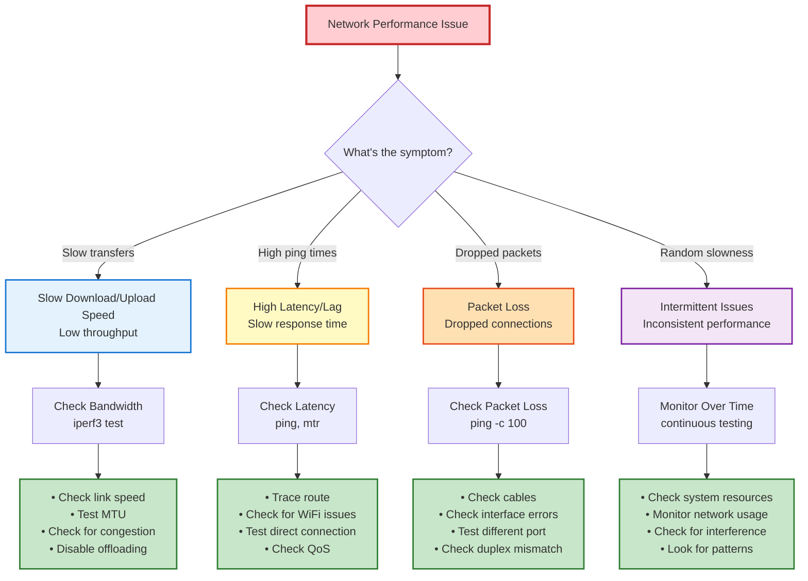
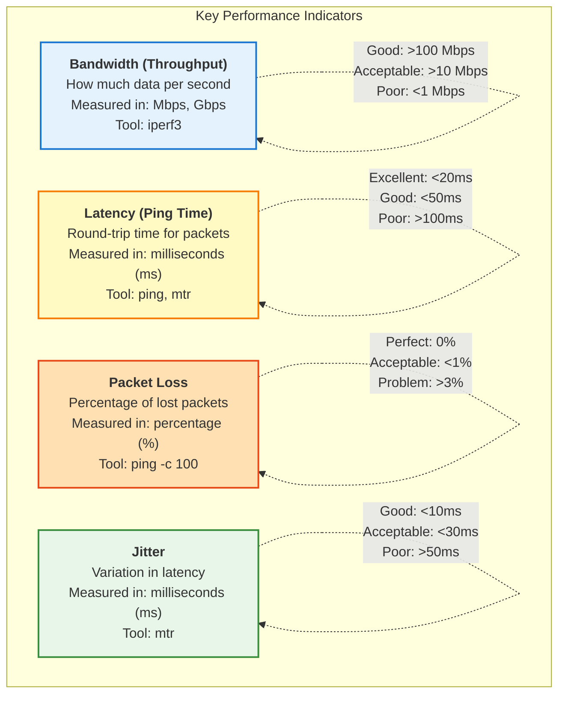

---
tags:
  - troubleshooting
  - performance
  - networking
  - bandwidth
  - latency
  - optimization
  - rhel
---

# Network Performance Troubleshooting

Complete guide to diagnosing and fixing network performance issues including slow speeds, high latency, and packet loss.

---

## Performance Problem Decision Tree



---

## Understanding Network Performance Metrics

### Key Metrics



---

## Problem 1: Slow Network Speed

### Symptoms
- Downloads/uploads are slow
- File transfers take too long
- Speedtest shows low numbers
- Video buffering

### Diagnosis Steps

#### Step 1: Check Current Link Speed

**View interface speed:**
```bash
ethtool ens33 | grep Speed
```

**Good Output:**
```
Speed: 1000Mb/s
Duplex: Full
```

**Bad Output:**
```
Speed: 10Mb/s        # Should be 100 or 1000
Duplex: Half         # Should be Full
```

**Check all network settings:**
```bash
ethtool ens33
```

**Key things to check:**
- Speed: Should be 1000Mb/s (or 100Mb/s minimum)
- Duplex: Should be Full (not Half)
- Link detected: Should be yes
- Auto-negotiation: Should be on

#### Step 2: Test Actual Throughput

**Install iperf3:**
```bash
sudo dnf install iperf3
```

**Run bandwidth test:**

**On server machine:**
```bash
iperf3 -s
```

**On client machine:**
```bash
# Test TCP throughput
iperf3 -c server_ip

# Example output:
# [  5]   0.00-10.00  sec  1.09 GBytes   940 Mbits/sec
```

**Good Results:**
- 1Gbps link: 900+ Mbps
- 100Mbps link: 90+ Mbps
- WiFi: Varies (50-300 Mbps typical)

**Test UDP bandwidth:**
```bash
# Client sends at 100 Mbps
iperf3 -c server_ip -u -b 100M
```

#### Step 3: Check Interface Statistics

**View error counters:**
```bash
ip -s link show ens33
```

**Example output:**
```
RX: bytes  packets  errors  dropped  overrun  mcast
    123456  8901    0       0        0        234
TX: bytes  packets  errors  dropped  carrier  collsns
    234567  9012    0       0        0        0
```

**Bad signs:**
- Non-zero errors
- Non-zero dropped packets
- High collision count

**Detailed statistics:**
```bash
ethtool -S ens33 | grep -i error
ethtool -S ens33 | grep -i drop
```

### Fixes

#### Fix 1: Correct Speed and Duplex

**Auto-negotiation (recommended):**
```bash
sudo ethtool -s ens33 autoneg on
```

**Manual setting (if auto-neg fails):**
```bash
# Force 1000Mbps Full Duplex
sudo ethtool -s ens33 speed 1000 duplex full autoneg off

# For 100Mbps
sudo ethtool -s ens33 speed 100 duplex full autoneg off
```

**Make persistent:**
```bash
sudo nmcli connection modify ens33 \
  802-3-ethernet.auto-negotiate yes

sudo nmcli connection up ens33
```

#### Fix 2: Adjust MTU (Maximum Transmission Unit)

**Check current MTU:**
```bash
ip link show ens33 | grep mtu
```

**Test optimal MTU:**
```bash
# Test with different MTU sizes
# Standard Ethernet: 1500
# Jumbo frames: 9000

# Test if path supports 1500 byte packets
ping -M do -s 1472 -c 4 8.8.8.8
# 1472 + 28 (IP+ICMP header) = 1500

# If fragmentation needed, reduce MTU
```

**Set MTU:**
```bash
# Temporary
sudo ip link set dev ens33 mtu 1500

# Permanent
sudo nmcli connection modify ens33 802-3-ethernet.mtu 1500
sudo nmcli connection up ens33
```

**For Jumbo Frames (if supported):**
```bash
sudo nmcli connection modify ens33 802-3-ethernet.mtu 9000
sudo nmcli connection up ens33
```

#### Fix 3: Disable Offloading Features

**Check current offload settings:**
```bash
ethtool -k ens33
```

**Disable problematic offloads:**
```bash
# Disable Generic Receive Offload
sudo ethtool -K ens33 gro off

# Disable TCP Segmentation Offload
sudo ethtool -K ens33 tso off

# Disable Generic Segmentation Offload
sudo ethtool -K ens33 gso off
```

**Test throughput after each change**

#### Fix 4: Tune TCP Parameters

**View current TCP settings:**
```bash
sysctl net.ipv4.tcp_rmem
sysctl net.ipv4.tcp_wmem
sysctl net.core.rmem_max
sysctl net.core.wmem_max
```

**Optimize for high throughput:**
```bash
# Increase TCP buffer sizes
sudo sysctl -w net.core.rmem_max=134217728
sudo sysctl -w net.core.wmem_max=134217728
sudo sysctl -w net.ipv4.tcp_rmem="4096 87380 67108864"
sudo sysctl -w net.ipv4.tcp_wmem="4096 65536 67108864"

# Enable TCP window scaling
sudo sysctl -w net.ipv4.tcp_window_scaling=1

# Enable TCP timestamps
sudo sysctl -w net.ipv4.tcp_timestamps=1
```

**Make permanent:**
```bash
sudo bash -c 'cat >> /etc/sysctl.conf << EOF
net.core.rmem_max = 134217728
net.core.wmem_max = 134217728
net.ipv4.tcp_rmem = 4096 87380 67108864
net.ipv4.tcp_wmem = 4096 65536 67108864
net.ipv4.tcp_window_scaling = 1
net.ipv4.tcp_timestamps = 1
EOF'

sudo sysctl -p
```

---

## Problem 2: High Latency (Lag)

### Symptoms
- High ping times (>100ms)
- Slow response from servers
- Web pages take long to start loading
- Gaming lag

### Diagnosis Steps

#### Step 1: Measure Latency

**Basic ping test:**
```bash
# Ping gateway
ping -c 10 192.168.1.1

# Ping internet
ping -c 10 8.8.8.8

# Ping domain
ping -c 10 google.com
```

**Interpret results:**
```
--- 8.8.8.8 ping statistics ---
10 packets transmitted, 10 received, 0% packet loss
rtt min/avg/max/mdev = 12.3/45.6/89.2/15.4 ms
```

**What to look for:**
- `avg`: Average latency (should be <50ms for internet)
- `mdev`: Jitter/variation (should be low)
- Packet loss: Should be 0%

#### Step 2: Trace the Route

**Use traceroute:**
```bash
traceroute google.com
```

**Example output:**
```
 1  192.168.1.1 (192.168.1.1)  1.234 ms   # Your router
 2  10.0.0.1 (10.0.0.1)  5.678 ms         # ISP
 3  * * *                                  # Firewall/hidden hop
 4  142.250.80.46 (142.250.80.46)  23.4 ms  # Destination
```

**Look for:**
- High latency at specific hop (problem area)
- Timeouts (* * *)
- Sudden jumps in latency

**Better: Use MTR (combines ping + traceroute):**
```bash
# Install
sudo dnf install mtr

# Run
mtr google.com

# Save report
mtr --report --report-cycles 100 google.com > mtr-report.txt
```

**MTR Output Interpretation:**
```
HOST: yourpc       Loss%   Snt   Last   Avg  Best  Wrst StDev
  1. gateway       0.0%    10    1.2   1.3   1.1   1.5   0.1
  2. isp-router    0.0%    10    5.4   5.6   5.2   6.1   0.3
  3. backbone      2.0%    10   45.3  46.1  44.2  52.3   2.4
```

**Red flags:**
- Loss% >0
- High StDev (jitter)
- Avg >100ms to nearby servers

### Fixes

#### Fix 1: Check WiFi vs Wired

**If on WiFi, test wired connection:**
```bash
# Ping over WiFi
ping -c 20 8.8.8.8

# Connect ethernet cable
# Ping over wired
ping -c 20 8.8.8.8

# Compare latency and jitter
```

**WiFi-specific fixes:**
- Move closer to access point
- Change WiFi channel (avoid interference)
- Use 5GHz instead of 2.4GHz
- Update WiFi drivers

#### Fix 2: QoS (Quality of Service)

**Check if QoS is causing issues:**
```bash
# View current qdisc (queuing discipline)
tc qdisc show dev ens33
```

**Reset to default:**
```bash
sudo tc qdisc del dev ens33 root
```

#### Fix 3: Check System Load

**High CPU can cause latency:**
```bash
# Check CPU usage
top

# Check load average
uptime

# Check for high I/O wait
iostat 1
```

**If CPU is overloaded:**
```bash
# Find CPU-intensive processes
ps aux --sort=-%cpu | head -10

# Limit process priority
nice -n 19 ./cpu-intensive-process
```

#### Fix 4: Disable Power Saving

**Network card power management can add latency:**
```bash
# Check current setting
ethtool ens33 | grep "Wake-on"

# Disable power management
sudo ethtool -s ens33 wol d

# Make persistent
sudo nmcli connection modify ens33 \
  802-3-ethernet.wake-on-lan ignore
```

---

## Problem 3: Packet Loss

### Symptoms
- Dropped SSH connections
- Video/audio cuts out
- Download failures
- Timeouts

### Diagnosis Steps

#### Step 1: Measure Packet Loss

**Extended ping test:**
```bash
# Ping 100 times
ping -c 100 8.8.8.8

# Example output:
# 100 packets transmitted, 97 received, 3% packet loss
```

**Acceptable loss:**
- 0%: Perfect
- <1%: Acceptable
- 1-3%: Noticeable issues
- >3%: Serious problem

**Continuous monitoring:**
```bash
# Ping with timestamp
ping 8.8.8.8 | while read line; do echo "$(date): $line"; done

# Or use mtr
mtr --report --report-cycles 1000 8.8.8.8
```

#### Step 2: Check Interface Errors

**View detailed statistics:**
```bash
ip -s -s link show ens33
```

**Check specific error types:**
```bash
ethtool -S ens33 | grep -E "drop|error|crc|collision"
```

**Common error types:**
- `rx_errors`: Receive errors (bad cable, interference)
- `tx_errors`: Transmit errors
- `rx_dropped`: Buffer overflow (CPU too slow)
- `collisions`: Duplex mismatch

### Fixes

#### Fix 1: Check Physical Connection

**Test cable:**
```bash
# Check link status
ethtool ens33 | grep -i link

# Check for errors while wiggling cable
watch -n 1 'ethtool -S ens33 | grep error'
```

**Replace cable if:**
- Errors increase when moving cable
- Old cable (Cat5 instead of Cat6)
- Visible damage

#### Fix 2: Fix Duplex Mismatch

**Most common cause of packet loss!**

**Check current setting:**
```bash
ethtool ens33 | grep Duplex
```

**If showing Half Duplex:**
```bash
# Enable auto-negotiation
sudo ethtool -s ens33 autoneg on

# Or force Full Duplex
sudo ethtool -s ens33 duplex full speed 1000 autoneg off
```

**Check switch port** - ensure it matches

#### Fix 3: Increase Ring Buffer

**Check current ring buffer size:**
```bash
ethtool -g ens33
```

**Increase if dropped packets:**
```bash
# Increase RX ring buffer
sudo ethtool -G ens33 rx 4096

# Increase TX ring buffer
sudo ethtool -G ens33 tx 4096
```

#### Fix 4: Check for Network Congestion

**Monitor bandwidth usage:**
```bash
# Install iftop
sudo dnf install iftop

# Monitor in real-time
sudo iftop -i ens33
```

**Check for bandwidth hogs:**
```bash
# Install nethogs
sudo dnf install nethogs

# View per-process bandwidth
sudo nethogs ens33
```

---

## Problem 4: Intermittent Performance

### Symptoms
- Performance varies over time
- Sometimes fast, sometimes slow
- Random disconnections

### Diagnosis Tools

#### Tool 1: Continuous Monitoring

**Create monitoring script:**
```bash
#!/bin/bash
# network-monitor.sh

LOG_FILE="network-monitor-$(date +%Y%m%d-%H%M%S).log"
INTERVAL=5

echo "Starting network monitoring - logging to $LOG_FILE"
echo "Press Ctrl+C to stop"
echo

while true; do
  TIMESTAMP=$(date '+%Y-%m-%d %H:%M:%S')
  
  # Ping test
  PING_RESULT=$(ping -c 1 -W 1 8.8.8.8 2>&1 | grep 'time=' | awk -F'time=' '{print $2}' | awk '{print $1}')
  
  # Bandwidth check (sample)
  RX_BYTES=$(cat /sys/class/net/ens33/statistics/rx_bytes)
  TX_BYTES=$(cat /sys/class/net/ens33/statistics/tx_bytes)
  
  # Log
  echo "$TIMESTAMP | Ping: ${PING_RESULT:-TIMEOUT} | RX: $RX_BYTES | TX: $TX_BYTES" | tee -a $LOG_FILE
  
  sleep $INTERVAL
done
```

**Run it:**
```bash
chmod +x network-monitor.sh
./network-monitor.sh
```

#### Tool 2: Long-term Statistics

**Using sar (sysstat):**
```bash
# Install
sudo dnf install sysstat
sudo systemctl enable sysstat
sudo systemctl start sysstat

# View network statistics
sar -n DEV 1 10

# View historical data
sar -n DEV -f /var/log/sa/sa$(date +%d)
```

#### Tool 3: Graphical Monitoring

**Using iftop:**
```bash
sudo iftop -i ens33 -P -n

# Options:
# -P: Show ports
# -n: Don't resolve hostnames
# -B: Show bytes instead of bits
```

### Fixes

#### Fix 1: Check for Scheduled Tasks

**Look for cron jobs causing issues:**
```bash
# View user crontabs
crontab -l

# System crontabs
ls -la /etc/cron.*

# Check for running cron jobs
ps aux | grep cron
```

#### Fix 2: Monitor for Resource Exhaustion

**Check connection limits:**
```bash
# View current connections
ss -s

# Check file descriptor limits
ulimit -n
cat /proc/sys/fs/file-max

# Check for connection exhaustion
ss -tan | awk '{print $1}' | sort | uniq -c
```

**Increase limits if needed:**
```bash
# Temporary
sudo sysctl -w net.core.somaxconn=4096

# Permanent
echo "net.core.somaxconn = 4096" | sudo tee -a /etc/sysctl.conf
sudo sysctl -p
```

#### Fix 3: Check for Hardware Issues

**Monitor hardware errors:**
```bash
# Check system logs
sudo journalctl -k | grep -i network

# Check for hardware errors
sudo dmesg | grep -i error
sudo dmesg | grep -i ens33

# Check temperatures
sensors
```

---

## Performance Optimization Checklist

### Quick Wins

```bash
#!/bin/bash
# network-optimize.sh - Quick performance fixes

echo "Network Performance Optimization"
echo "================================="
echo

# 1. Check current speed
echo "1. Current Link Speed:"
ethtool ens33 | grep Speed
echo

# 2. Enable auto-negotiation
echo "2. Enabling auto-negotiation..."
sudo ethtool -s ens33 autoneg on
echo

# 3. Set optimal MTU
echo "3. Setting MTU to 1500..."
sudo ip link set dev ens33 mtu 1500
echo

# 4. Increase TCP buffers
echo "4. Optimizing TCP buffers..."
sudo sysctl -w net.core.rmem_max=134217728
sudo sysctl -w net.core.wmem_max=134217728
sudo sysctl -w net.ipv4.tcp_rmem="4096 87380 67108864"
sudo sysctl -w net.ipv4.tcp_wmem="4096 65536 67108864"
echo

# 5. Enable TCP window scaling
echo "5. Enabling TCP optimizations..."
sudo sysctl -w net.ipv4.tcp_window_scaling=1
sudo sysctl -w net.ipv4.tcp_timestamps=1
sudo sysctl -w net.ipv4.tcp_sack=1
echo

# 6. Increase network queue
echo "6. Increasing network queue length..."
sudo sysctl -w net.core.netdev_max_backlog=5000
echo

echo "Optimization complete!"
echo "Test with: iperf3 -c server_ip"
```

### Full System Tune

**For high-performance servers:**
```bash
# /etc/sysctl.conf additions

# Increase Linux autotuning TCP buffer limits
net.core.rmem_max = 134217728
net.core.wmem_max = 134217728
net.ipv4.tcp_rmem = 4096 87380 67108864
net.ipv4.tcp_wmem = 4096 65536 67108864

# Increase number of incoming connections
net.core.somaxconn = 4096

# Increase number of incoming connections backlog
net.core.netdev_max_backlog = 5000

# Enable TCP window scaling
net.ipv4.tcp_window_scaling = 1

# Enable timestamps
net.ipv4.tcp_timestamps = 1

# Enable select acknowledgments
net.ipv4.tcp_sack = 1

# Increase local port range
net.ipv4.ip_local_port_range = 10000 65535

# Enable TCP Fast Open
net.ipv4.tcp_fastopen = 3

# Increase max connections
net.netfilter.nf_conntrack_max = 1000000

# Apply with: sudo sysctl -p
```

---

## Benchmark Your Network

### Comprehensive Test Script

```bash
#!/bin/bash
# network-benchmark.sh

SERVER_IP="${1:-8.8.8.8}"

echo "==============================="
echo "Network Performance Benchmark"
echo "Target: $SERVER_IP"
echo "==============================="
echo

echo "Test 1: Latency (Ping)"
echo "---------------------"
ping -c 20 $SERVER_IP | tail -n 3
echo

echo "Test 2: Jitter (MTR)"
echo "-------------------"
mtr --report --report-cycles 20 $SERVER_IP | tail -n 5
echo

echo "Test 3: Download Speed (if iperf3 server available)"
echo "----------------------------------------------------"
if command -v iperf3 &> /dev/null; then
  echo "Run on server: iperf3 -s"
  echo "Run on client: iperf3 -c $SERVER_IP"
else
  echo "iperf3 not installed: sudo dnf install iperf3"
fi
echo

echo "Test 4: Current Interface Stats"
echo "-------------------------------"
ethtool ens33 | grep -E "Speed|Duplex|Link"
echo

echo "Test 5: Error Check"
echo "------------------"
ip -s link show ens33 | grep -A 2 "RX:"
ip -s link show ens33 | grep -A 2 "TX:"
echo

echo "==============================="
echo "Benchmark Complete"
echo "==============================="
```

---

## Quick Reference Commands

### Latency Testing
```bash
# Basic ping
ping -c 10 8.8.8.8

# Continuous ping with timestamp
ping 8.8.8.8 | ts '[%H:%M:%S]'

# MTR (better than traceroute)
mtr --report google.com
```

### Bandwidth Testing
```bash
# iperf3 server
iperf3 -s

# iperf3 client
iperf3 -c server_ip

# Test UDP
iperf3 -c server_ip -u -b 100M
```

### Interface Information
```bash
# Link status
ethtool ens33

# Statistics
ip -s link show ens33

# Errors
ethtool -S ens33 | grep -i error
```

### Real-time Monitoring
```bash
# Bandwidth per connection
sudo iftop -i ens33

# Bandwidth per process
sudo nethogs ens33

# Overall statistics
nload ens33
```

---

## See Also

- [Connectivity Troubleshooting](connectivity.md)
- [DNS Issues](dns-issues.md)
- [nmcli Commands](../commands/nmcli.md)
- [OSI Model](../basics/osi-model.md)

---

**Last Updated:** 2024-02-09  
**Difficulty:** Intermediate to Advanced  
**Estimated Time:** 45 minutes